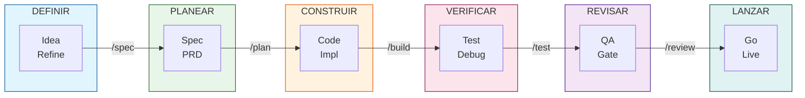

# Plantilla Dev AI

**Workspace OpenCode para desarrollo asistido por IA con metodología Spec-Driven Development.**

Una plantilla production-grade que integra 30+ skills de ingeniería, comandos slash, agentes especializados y hooks automatizados para acelerar el desarrollo con IA. Diseñada para equipos y desarrolladores que quieren calidad consistente en proyectos asistidos por IA.

---

## Características

- **30+ Skills de Ingeniería** — TDD, Spec-Driven Development, Code Review, Seguridad, Performance, UI/UX, DDD/Hexagonal, y más
- **7 Comandos Slash** — `/spec`, `/plan`, `/build`, `/test`, `/review`, `/ship`, `/code-simplify`
- **5 Agentes Especializados** — Analysis, Implement, Code-Reviewer, Test-Engineer, Security-Auditor
- **Nativo OpenCode** — Comandos slash, agentes y skills cargados desde `.opencode/`
- **Hooks Automatizados** — Session start, SDD caching, simplify-ignore
- **Documentación Técnica Integrada** — Referencias de Clean Code, DDD, UI/UX, Testing, Seguridad y más
- **Licencia MIT** — Libre para proyectos personales y comerciales

---

## Prerrequisitos

- **Node.js >= 18** y **pnpm**
- **OpenCode IDE**
- **Git**

---

## Quick Start

### 1. Clona la plantilla
```bash
git clone https://github.com/Fisherk2/plantilla-dev-ai.git mi-proyecto
cd mi-proyecto
```

### 2. Instala dependencias del plugin OpenCode
```bash
cd .opencode && pnpm install && cd ..
```

### 3. Configura Context7 (documentación actualizada de librerías)
```bash
npx ctx7@latest setup
```

### 4. Verifica que los comandos están disponibles
```bash
ls .opencode/commands/
# Deberías ver: build.md  code-simplify.md  plan.md  review.md  ship.md  spec.md  test.md
```

### 5. Ejecuta tu primer workflow
```bash
# 1. Define una especificación
/spec "Crea una función que sume dos números"

# 2. Planifica las tareas
/plan

# 3. Implementa con TDD
/build

# 4. Revisa la calidad antes de merge
/review
```

> **¿Nuevo en OpenCode?** Lee la [Guía de inicio rápido](docs/ai-agent-setup/getting-started.md) para entender el ecosistema de skills.

---

## Flujo de Trabajo



### Ciclo Completo

| Fase | Comando | Qué hace | Skill Asociado |
|------|---------|----------|----------------|
| Iniciar | `/spec` | Crea una especificación estructurada antes de escribir código | `spec-driven-development` |
| Planificar | `/plan` | Descompone el trabajo en tareas ordenadas | `planning-and-task-breakdown` |
| Construir | `/build` | Implementa incrementalmente con TDD (Red-Green-Refactor) | `incremental-implementation` |
| Verificar | `/test` | Escribe tests que fallan, implementa, refactoriza | `test-driven-development` |
| Revisar | `/review` | Auditoría en 5 ejes: correctitud, legibilidad, arquitectura, seguridad, rendimiento | `code-review-and-quality` |
| Simplificar | `/code-simplify` | Refactoriza código complejo sin cambiar comportamiento | `code-simplification` |
| Lanzar | `/ship` | Prepara y despliega a producción con checklist y monitoreo | `shipping-and-launch` |

---

## Estructura del Proyecto

```
.env.example           # Variables de entorno (plantilla)
AGENTS.md              # Personas y orquestación de agentes
CONTRIBUTING.md        # Directrices de contribución
USER_GUIDE.md          # Referencia completa de skills

commands/              # 7 comandos slash para OpenCode

.opencode/             # Configuración principal de OpenCode
├── agents/ → agents/  # Symlink a agents/
├── commands/ → commands/  # Symlink a commands/
├── skills/ → skills/  # Symlink a skills/
└── package.json       # Dependencias del plugin

agents/                # Definiciones de agentes
docs/                  # Documentación del proyecto
├── ai-agent-setup/    # Guías de setup por plataforma
├── ARCHITECTURE.md    # Arquitectura del proyecto
├── API_REFERENCE.md   # Referencia de API
└── SETUP.md           # Setup detallado

hooks/                 # Automatizaciones del workspace
├── session-start.sh   # Hook de inicio de sesión
├── sdd-cache-pre.sh   # SDD caching (pre)
├── sdd-cache-post.sh  # SDD caching (post)
└── simplify-ignore.sh # Simplificación de archivos ignorados

references/            # Guías de referencia técnica
├── clean-code/        # Principios de código limpio
├── ddd-*/             # Domain-Driven Design
├── ui-ux/             # Patrones de diseño UI/UX
├── testing/           # Estrategias de testing
├── security/          # Checklist de seguridad
└── performance/       # Checklist de rendimiento

scripts/               # Scripts auxiliares
├── setup.sh
├── build.sh
├── test.sh
└── lint.sh

skills/                # 30+ skills de ingeniería (carga directa)
specs/                 # Especificaciones del proyecto
src/                   # Código fuente del proyecto
tests/                 # Tests del proyecto
```

---

## Configuración

### Personalizar Skills
Cada skill en `skills/` se puede modificar para adaptarlo a tu stack. Ver [USER_GUIDE.md](USER_GUIDE.md#crear-un-nuevo-skill) para crear skills propios.

### Comandos y Agentes
Los comandos slash y agentes se cargan automáticamente desde `commands/` y `.opencode/agents/`.

---

## Documentación

| Guía | Descripción |
|------|-------------|
| [Guía de inicio rápido](docs/ai-agent-setup/getting-started.md) | Primeros pasos en 5 minutos |
| [Guía completa](USER_GUIDE.md) | Referencia detallada de todos los skills |
| [Guía de agentes](AGENTS_GUIDE.md) | Personas de agentes y orquestación |
| [Arquitectura](docs/ARCHITECTURE.md) | Decisiones arquitectónicas del proyecto |
| [Contribuir](CONTRIBUTING.md) | Directrices de contribución |

---

## Troubleshooting

| Problema | Causa posible | Solución |
|----------|---------------|----------|
| `/spec` no funciona | Plugin OpenCode no instalado | Ejecuta `cd .opencode && pnpm install` |
| Context7 da error de cuota | Límite de API alcanzado | Ejecuta `npx ctx7@latest login` o configura `CONTEXT7_API_KEY` |
| Los skills no cargan | Ruta incorrecta | Usa `@skills/<skill-name>/SKILL.md` o carga desde `skills/` |

---

## Licencia

MIT — Ver [LICENSE](LICENSE) para más detalles.

---

*Última revisión: 2026-05-21*
