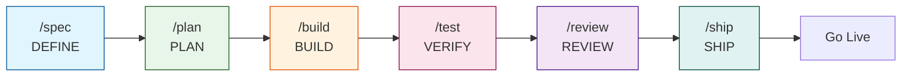

# Plantilla Dev AI

**Workspace OpenCode para desarrollo asistido por IA con metodología Spec-Driven Development.**

Una plantilla production-grade que integra 33 skills de ingeniería organizados en 6 fases del ciclo SDD, comandos slash y agentes especializados para acelerar el desarrollo con IA. Diseñada para equipos y desarrolladores que quieren calidad consistente en proyectos asistidos por IA.

---

## Características

- **33 Skills de Ingeniería** — TDD, Spec-Driven Development, Code Review, Seguridad, Performance, UI/UX, DDD/Hexagonal, patrones de diseño, y más, organizados en 6 fases SDD
- **7 Comandos Slash** — `/spec`, `/plan`, `/build`, `/test`, `/review`, `/ship`, `/code-simplify`
- **5 Agentes Especializados** — Analysis, Implement, Code-Reviewer, Test-Engineer, Security-Auditor
- **Nativo OpenCode** — Comandos slash, agentes y skills cargados desde `.opencode/`
- **Documentación Técnica Integrada** — Referencias de Clean Code, DDD, UI/UX, Testing, Seguridad y más
- **Licencia MIT** — Libre para proyectos personales y comerciales

---

## Prerrequisitos

- **Node.js >= 18** y **bun**
- **OpenCode IDE**
- **Git**

---

## Quick Start

### 1. Clona la plantilla
```bash
git clone https://github.com/Fisherk2/plantilla-dev-ai.git mi-proyecto
cd mi-proyecto
```

### 2. Instala dependencias del plugin OpenCode
```bash
cd .opencode && bun install && cd ..
```

### 3. Configura Context7 (documentación actualizada de librerías)
```bash
npx ctx7@latest setup
```

### 4. Verifica que los comandos están disponibles
```bash
ls .opencode/commands/
# Deberías ver: build.md  code-simplify.md  plan.md  review.md  ship.md  spec.md  test.md
```

### 5. Ejecuta tu primer workflow SDD completo
```bash
# 1. Define una especificación (DEFINE)
/spec "Crea una API REST de tareas"

# 2. Planifica las tareas (PLAN)
/plan

# 3. Implementa con TDD (BUILD)
/build

# 4. Prueba y verifica (VERIFY)
/test

# 5. Revisa la calidad antes de merge (REVIEW)
/review

# 6. Prepara y despliega a producción (SHIP)
/ship
```

Los skills se activan automáticamente según la fase: diseño de API → [api-and-interface-design](skills/api-and-interface-design/SKILL.md), UI → [frontend-ui-engineering](skills/frontend-ui-engineering/SKILL.md), lógica de dominio → [clean-ddd-hexagonal](skills/clean-ddd-hexagonal/SKILL.md), manejo de errores → [error-handling-patterns](skills/error-handling-patterns/SKILL.md), entre otros.

---

## Flujo de Trabajo



### Ciclo Completo

| Fase | Comando | Skill Principal | Skills Complementarios |
|------|---------|----------------|----------------------|
| Definir | `/spec` | [spec-driven-development](skills/spec-driven-development/SKILL.md) | clean-ddd-hexagonal, design-patterns, architecture-diagrams, ui-ux-design-pro, agent-md-refactor (PRE-FLIGHT), crafting-effective-readmes (PRE-FLIGHT) |
| Planificar | `/plan` | [planning-and-task-breakdown](skills/planning-and-task-breakdown/SKILL.md) | clean-ddd-hexagonal, design-patterns, architecture-diagrams |
| Construir | `/build` | [incremental-implementation](skills/incremental-implementation/SKILL.md) | solid, error-handling-patterns, ui-ux-design-pro, design-taste-frontend, bash-defensive-patterns, clean-ddd-hexagonal |
| Verificar | `/test` | [test-driven-development](skills/test-driven-development/SKILL.md) | error-handling-patterns, design-taste-frontend, incident-response (escalación) |
| Revisar | `/review` | [code-review-and-quality](skills/code-review-and-quality/SKILL.md) | solid, error-handling-patterns, design-patterns, refactoring-patterns, design-taste-frontend |
| Simplificar | `/code-simplify` | [code-simplification](skills/code-simplification/SKILL.md) | refactoring-patterns, solid |
| Lanzar | `/ship` | [shipping-and-launch](skills/shipping-and-launch/SKILL.md) | crafting-effective-readmes, architecture-diagrams, bash-defensive-patterns, incident-response |

---

## Estructura del Proyecto

```
.env.example              # Variables de entorno (plantilla)
AGENTS.md                 # Personas y orquestación de agentes
CONTRIBUTING.md           # Directrices de contribución
USER_GUIDE.md             # Referencia completa de skills
README.md                 # Este archivo

commands/                 # 7 comandos slash para OpenCode
├── spec.md               #   DEFINE
├── plan.md               #   PLAN
├── build.md              #   BUILD
├── test.md               #   VERIFY
├── review.md             #   REVIEW
├── code-simplify.md      #   REVIEW (simplificación)
└── ship.md               #   SHIP

.opencode/                # Configuración principal de OpenCode
├── agents/ → agents/     # Symlink a agents/
├── commands/ → commands/ # Symlink a commands/
├── skills/ → skills/     # Symlink a skills/
└── package.json          # Dependencias del plugin

agents/                   # 5 agentes especializados
├── quetzalcoatl.md       #   Arquitecto de especificaciones
├── tezcatlipoca.md       #   Build agent
├── code-reviewer.md      #   Senior Staff Engineer
├── test-engineer.md      #   QA Specialist
└── security-auditor.md   #   Security Engineer

skills/                   # 33 skills organizados por fase SDD
├── idea-refine/              # DEFINE
├── spec-driven-development/  # DEFINE
├── agent-md-refactor/        # DEFINE (PRE-FLIGHT)
├── crafting-effective-readmes/ # DEFINE/SHIP
├── clean-ddd-hexagonal/      # DEFINE/PLAN/BUILD
├── design-patterns/          # DEFINE/PLAN/REVIEW
├── architecture-diagrams/    # DEFINE/PLAN/SHIP
├── ui-ux-design-pro/         # DEFINE/BUILD
│
├── planning-and-task-breakdown/ # PLAN
│
├── incremental-implementation/  # BUILD
├── context-engineering/         # BUILD
├── source-driven-development/   # BUILD
├── frontend-ui-engineering/     # BUILD
├── api-and-interface-design/    # BUILD
├── test-driven-development/     # BUILD
├── solid/                       # BUILD/REVIEW
├── error-handling-patterns/     # BUILD/VERIFY/REVIEW
├── design-taste-frontend/       # BUILD/VERIFY/REVIEW
├── bash-defensive-patterns/     # BUILD/SHIP
│
├── browser-testing-with-devtools/ # VERIFY
├── debugging-and-error-recovery/  # VERIFY
│
├── code-review-and-quality/       # REVIEW
├── code-simplification/           # REVIEW
├── security-and-hardening/        # REVIEW
├── performance-optimization/      # REVIEW
├── refactoring-patterns/          # REVIEW
│
├── git-workflow-and-versioning/   # SHIP
├── ci-cd-and-automation/          # SHIP
├── deprecation-and-migration/     # SHIP
├── documentation-and-adrs/        # SHIP
├── shipping-and-launch/           # SHIP
├── incident-response/             # VERIFY/SHIP
│
└── using-agent-skills/            # META: descubrimiento de skills

references/               # Guías de referencia técnica
├── testing-patterns.md
├── security-checklist.md
├── performance-checklist.md
├── accessibility-checklist.md
└── orchestration-patterns.md

docs/                     # Documentación del proyecto
├── ai-agent-setup/
│   ├── opencode-setup.md
│   ├── prompt-anatomy.md
│   └── skill-anatomy.md
├── decisions/            # ADRs (Architecture Decision Records)
└── ...

scripts/                  # Scripts auxiliares
specs/                    # Especificaciones del proyecto (SPEC.md)
src/                      # Código fuente del proyecto
tests/                    # Tests del proyecto
```

---

## Configuración

### Personalizar Skills
Cada skill en `skills/` se puede modificar para adaptarlo a tu stack. Ver [USER_GUIDE.md](USER_GUIDE.md#crear-un-nuevo-skill) para crear skills propios.

### Comandos y Agentes
Los comandos slash y agentes se cargan automáticamente desde `commands/` y `.opencode/agents/`.

---

## Documentación

| Guía | Descripción |
|------|-------------|
| [Guía completa](skills/using-agent-skills/SKILL.md) | Referencia detallada de todos los skills |
| [Guía de agentes](docs/opencode/08-orchestration-patterns.md) | Personas de agentes y orquestación |
| [Contribuir](CONTRIBUTING.md) | Directrices de contribución |

---

## Troubleshooting

| Problema | Causa posible | Solución |
|----------|---------------|----------|
| `/spec` no funciona | Plugin OpenCode no instalado | Ejecuta `cd .opencode && bun install` |
| Context7 da error de cuota | Límite de API alcanzado | Ejecuta `npx ctx7@latest login` o configura `CONTEXT7_API_KEY` |
| Los skills no cargan | Ruta incorrecta | Usa `@skills/<skill-name>/SKILL.md` o carga desde `skills/` |

---

## Licencia

MIT — Ver [LICENSE](LICENSE) para más detalles.

---

*Última revisión: 2026-05-21*
