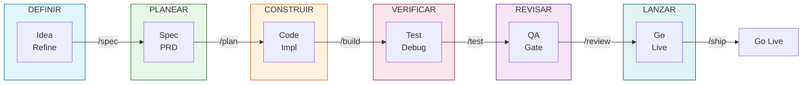

# Plantilla Dev AI

Espacio de trabajo OpenCode para desarrollo asistido por IA con metodología Spec-Driven Development.

## Inicio Rápido

1. Lee [getting-started.md](docs/ai-agent-setup/getting-started.md) para la guía paso a paso
2. Usa `/spec` o `@skills/spec-driven-development/SKILL.md` para crear especificaciones
3. Usa `/build` o `@skills/incremental-implementation/SKILL.md` para implementar incrementalmente
4. Consulta `@skills/using-agent-skills/SKILL.md` para descubrir qué skill usar
5. Ejecuta `/review` o `@skills/code-review-and-quality/SKILL.md` antes de hacer merge

> Para información detallada, consulta [USER_GUIDE.md](USER_GUIDE.md).

## Flujo de Trabajo

### Ciclo Completo

| Fase | Comando | Skill Esencial |
|------|---------|----------------|
| Iniciar proyecto | `/spec` | `spec-driven-development` |
| Planificar | `/plan` | `planning-and-task-breakdown` |
| Construir | `/build` | `incremental-implementation` |
| Verificar | `/test` | `test-driven-development` |
| Revisar | `/review` | `code-review-and-quality` |
| Simplificar | `/code-simplify` | `code-simplification` |
| Lanzar | `/ship` | `shipping-and-launch` |

## Documentación

| Guía | Descripción |
|-----|-------------|
| [Inicio Rápido](docs/ai-agent-setup/getting-started.md) | Guía de 5 pasos para nuevos usuarios |
| [Guía Completa](USER_GUIDE.md) | Referencia detallada de todos los skills |
| [Guía de Agentes](AGENTS_GUIDE.md) | Personas de agentes y orquestación |
| [Contribuir](CONTRIBUTING.md) | Directrices de contribución (Español) |

## Herramientas de la Plantilla

- **Context7**: Fetch de documentación actualizada para cualquier librería o framework (`npx ctx7@latest setup`)

## Licencia

MIT