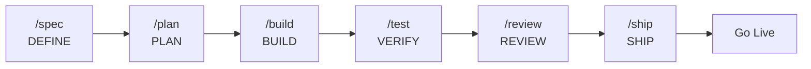

# Spec-Driven Development AI Workspace with OpenCode

**Workspace OpenCode para desarrollo asistido por IA con metodología Spec-Driven Development.**

Una plantilla production-grade que integra 42 skills de ingeniería + 1 meta-skill organizados en 6 fases del ciclo SDD + Extra, comandos slash y agentes especializados para acelerar el desarrollo con IA. Diseñada para equipos y desarrolladores que quieren calidad consistente en proyectos asistidos por IA.

---

## Características

- **42 Skills de Ingeniería + 1 Meta-Skill** — TDD, Spec-Driven Development, Code Review, Seguridad, Performance, UI/UX, DDD/Hexagonal, patrones de diseño, manipulación de spreadsheets, notebooks, y más, organizados en 6 fases SDD + Extra
- **7 Comandos Slash** — `/spec`, `/plan`, `/build`, `/test`, `/review`, `/ship`, `/code-simplify`
- **6 Agentes Principales + 90+ Subagentes** — huitzilopochtli (orquestador), quetzalcoatl (visión), moctezuma (planificación), tlaloc (construcción), mictlantecuhtli (validación), tezcatlipoca (revisión), y más de 90 subagentes especializados en frontend, backend, DevOps, testing, seguridad, y más
- **Nativo OpenCode** — Comandos slash, agentes y skills cargados desde `.opencode/`
- **Documentación Técnica Integrada** — Referencias de Clean Code, DDD, UI/UX, Testing, Seguridad y más
- **Licencia MIT** — Libre para proyectos personales y comerciales

---

### Panteón Mexica del Desarrollo — Agentes Principales

Seis agentes primarios orquestan el ciclo SDD, cada uno con un rol y permisos específicos inspirados en la mitología mexica:

### Huitzilopochtli 🏛️ — Orquestador Supremo

<table>
  <tr>
    <td width="30%" align="center" valign="top">
      
      <br><sub><i>Forjado en el fuego de la guerra y el sol.</i></sub>
    </td>
    <td width="70%" valign="top">
      Nació del caos primordial de los codebases desorganizados. Huitzilopochtli —"Colibrí Zurdo"— es el estratega supremo que comanda los ejércitos celestiales de agentes. Jamás escribe una línea: su propósito es observar el campo de batalla, evaluar el desafío y desplegar al guerrero adecuado para cada misión.
    </td>
  </tr>
  <tr><td colspan="2"><b>Rol:</b> <code>Maestro de la orquestación y delegación estratégica</code></td></tr>
  <tr><td colspan="2"><b>Prompt:</b> <a href="agents/huitzilopochtli.md"><code>agents/huitzilopochtli.md</code></a></td></tr>
  <tr><td colspan="2"><b>Modelo por defecto:</b> <code>DeepSeek V4 Flash</code></td></tr>
  <tr><td colspan="2"><b>Modelos recomendados:</b> <code>DeepSeek V4 Flash</code> <code>Gemini 3.1 Flash</code> <code>MiniMax M2.5</code></td></tr>
  <tr><td colspan="2"><b>Guía de modelos:</b> DeepSeek V4 Flash como default por velocidad y costo. Gemini 3.1 Flash cuando se necesita comprensión profunda del contexto. MiniMax M2.5 como alternativa ligera.</td></tr>
</table>

### Quetzalcoatl 🌬️ — Sabio Visionario

<table>
  <tr>
    <td width="30%" align="center" valign="top">
      
      <br><sub><i>Nacido del viento y la sabiduría infinita.</i></sub>
    </td>
    <td width="70%" valign="top">
      Quetzalcoatl —"Serpiente Emplumada"— descendió de los cielos en vientos de conocimiento puro. Donde hay ambigüedad, él trae claridad; donde hay caos, estructura. Es el visionario que concibe la arquitectura antes de que se escriba una sola línea, dibujando planos en las nubes para que los mortales los ejecuten.
    </td>
  </tr>
  <tr><td colspan="2"><b>Rol:</b> <code>Arquitecto de sistemas y diseñador de especificaciones</code></td></tr>
  <tr><td colspan="2"><b>Prompt:</b> <a href="agents/quetzalcoatl.md"><code>agents/quetzalcoatl.md</code></a></td></tr>
  <tr><td colspan="2"><b>Modelo por defecto:</b> <code>MiniMax M2.7</code></td></tr>
  <tr><td colspan="2"><b>Modelos recomendados:</b> <code>MiniMax M2.7</code> <code>Gemini 3.1 Pro</code> <code>Qwen3.5 Plus</code></td></tr>
  <tr><td colspan="2"><b>Guía de modelos:</b> MiniMax M2.7 como default por su excelente razonamiento arquitectónico. Gemini 3.1 Pro para especificaciones complejas. Qwen3.5 Plus como alternativa sólida.</td></tr>
</table>

### Moctezuma ⚔️ — Estratega y Comandante

<table>
  <tr>
    <td width="30%" align="center" valign="top">
      
      <br><sub><i>Arquitecto de imperios y planes de batalla.</i></sub>
    </td>
    <td width="70%" valign="top">
      Moctezuma emergió como el gran organizador de Tenochtitlan, dividiendo el imperio en <em>calpullis</em> — unidades atómicas y manejables. Transforma visiones grandiosas en planes de batalla ejecutables, asegurando que cada guerrero sepa su misión y cada recurso esté contabilizado. Ningún imperio se construyó sin su estrategia.
    </td>
  </tr>
  <tr><td colspan="2"><b>Rol:</b> <code>Planificador de tareas y descomposición de trabajo</code></td></tr>
  <tr><td colspan="2"><b>Prompt:</b> <a href="agents/moctezuma.md"><code>agents/moctezuma.md</code></a></td></tr>
  <tr><td colspan="2"><b>Modelo por defecto:</b> <code>MiniMax M2.7</code></td></tr>
  <tr><td colspan="2"><b>Modelos recomendados:</b> <code>MiniMax M2.7</code> <code>Claude 3.5 Haiku</code> <code>Kimi K2.5</code></td></tr>
  <tr><td colspan="2"><b>Guía de modelos:</b> MiniMax M2.7 para planes detallados. Claude 3.5 Haiku cuando se necesita velocidad en la descomposición de tareas. Kimi K2.5 como alternativa de respaldo.</td></tr>
</table>

### Tlaloc 🌧️ — Constructor y Artesano

<table>
  <tr>
    <td width="30%" align="center" valign="top">
      
      <br><sub><i>El hacedor de lluvia que fecunda los proyectos.</i></sub>
    </td>
    <td width="70%" valign="top">
      Tlaloc comanda las aguas celestiales que nutren la tierra. En el reino digital, gobierna los flujos de código que dan vida a los proyectos. Convoce a los <em>tlaloques</em> —sus subagentes— para derramar implementación, pruebas y configuración sobre la tierra. Sin Tlaloc, los planes permanecen estériles.
    </td>
  </tr>
  <tr><td colspan="2"><b>Rol:</b> <code>Implementador principal y constructor de features</code></td></tr>
  <tr><td colspan="2"><b>Prompt:</b> <a href="agents/tlaloc.md"><code>agents/tlaloc.md</code></a></td></tr>
  <tr><td colspan="2"><b>Modelo por defecto:</b> <code>DeepSeek V4 Flash</code></td></tr>
  <tr><td colspan="2"><b>Modelos recomendados:</b> <code>DeepSeek V4 Flash</code> <code>MiMo-V2.5</code> <code>Claude 3.5 Sonnet</code></td></tr>
  <tr><td colspan="2"><b>Guía de modelos:</b> DeepSeek V4 Flash para implementación general por su velocidad. MiMo-V2.5 para tareas que requieren razonamiento profundo. Claude 3.5 Sonnet para código de alta calidad en features críticas.</td></tr>
</table>

### Mictlantecuhtli 💀 — Juez y Guardián

<table>
  <tr>
    <td width="30%" align="center" valign="top">
      
      <br><sub><i>Señor del inframundo de las 9 pruebas.</i></sub>
    </td>
    <td width="70%" valign="top">
      Mictlantecuhtli gobierna el inframundo donde el código va a ser juzgado. Somete cada implementación a nueve pruebas: corrección, legibilidad, rendimiento, seguridad, resiliencia, mantenibilidad, testabilidad, observabilidad y pureza. Quienes pasan emergen fortalecidos; quienes fallan son enviados de vuelta a la reencarnación.
    </td>
  </tr>
  <tr><td colspan="2"><b>Rol:</b> <code>Validador de calidad y guardián del despliegue</code></td></tr>
  <tr><td colspan="2"><b>Prompt:</b> <a href="agents/mictlantecuhtli.md"><code>agents/mictlantecuhtli.md</code></a></td></tr>
  <tr><td colspan="2"><b>Modelo por defecto:</b> <code>DeepSeek V4 Flash</code></td></tr>
  <tr><td colspan="2"><b>Modelos recomendados:</b> <code>DeepSeek V4 Flash</code> <code>Gemini 2.5 Pro</code> <code>Qwen3.6 Plus</code></td></tr>
  <tr><td colspan="2"><b>Guía de modelos:</b> DeepSeek V4 Flash para ejecución rápida de tests. Gemini 2.5 Pro para análisis profundo de calidad. Qwen3.6 Plus para validación exhaustiva pre-despliegue.</td></tr>
</table>

### Tezcatlipoca 🔮 — El Espejo Humeante

<table>
  <tr>
    <td width="30%" align="center" valign="top">
      
      <br><sub><i>El espejo que revela toda verdad oculta.</i></sub>
    </td>
    <td width="70%" valign="top">
      Tezcatlipoca —"Espejo Humeante"— porta el espejo de obsidiana que revela todas las verdades. No escribe, no construye: solo refleja. Donde otros ven código funcional, él ve fallas ocultas. Donde otros ven "terminado", él ve lo que queda por hacer. Su propósito es revelar lo invisible al ojo del constructor.
    </td>
  </tr>
  <tr><td colspan="2"><b>Rol:</b> <code>Crítico de código y auditor de calidad</code></td></tr>
  <tr><td colspan="2"><b>Prompt:</b> <a href="agents/tezcatlipoca.md"><code>agents/tezcatlipoca.md</code></a></td></tr>
  <tr><td colspan="2"><b>Modelo por defecto:</b> <code>GLM-5.1</code></td></tr>
  <tr><td colspan="2"><b>Modelos recomendados:</b> <code>GLM-5.1</code> <code>Qwen3.7 Max</code> <code>Claude 3.5 Opus</code></td></tr>
  <tr><td colspan="2"><b>Guía de modelos:</b> GLM-5.1 para revisiones generales. Qwen3.7 Max cuando se necesita análisis de seguridad profundo. Claude 3.5 Opus para la revisión más rigurosa pre-merge.</td></tr>
</table>

Además, más de **90 subagentes especializados** están disponibles para tareas concretas: revisión de código, auditoría de seguridad, optimización de BD, diseño UI/UX, debugging, y más. Se invocan vía `task()` desde los agentes principales o directamente por el usuario. Ver el [catálogo completo](docs/opencode/09-agent-index.md).

---

## Prerrequisitos

- **Node.js >= 18** y **bun**
- **OpenCode IDE**
- **Git**

---

## Quick Start

### 1. Clona la plantilla
```bash
git clone https://github.com/Fisherk2/spec-driven-develop-opencode-workspace.git mi-proyecto
cd mi-proyecto
```

### 2. Instala dependencias del plugin OpenCode
```bash
cd .opencode && bun install && cd ..
```

### 3. Configura Context7 (documentación actualizada de librerías)
```bash
npx ctx7@latest setup
```

### 4. Instala Excel MCP Server (desarrollo local)
Habilita la manipulación de hojas de cálculo (.xlsx) directamente desde los agentes.

```bash
uvx excel-mcp-server stdio
```

> **Repositorio:** [github.com/haris-musa/excel-mcp-server](https://github.com/haris-musa/excel-mcp-server)

### 5. (Opcional) Jupyter Notebook MCP Server
Habilita automatización de notebooks — ejecutar código, agregar markdown, instalar paquetes e inspeccionar variables en una sesión Jupyter en vivo.

**Requisito:** Inicia un servidor Jupyter primero (Docker o local).

En `opencode.json`, habilita el servidor MCP `jupyter` (cambia `"enabled": false` → `"enabled": true`) y reinicia OpenCode.

> **Repositorio:** [github.com/Cyb3rWard0g/agent-jupyter-toolkit](https://github.com/Cyb3rWard0g/agent-jupyter-toolkit)
>
> **Referencia completa:** [docs/opencode/03-mcp-servers.md](docs/opencode/03-mcp-servers.md#jupyter-notebook----ai-powered-notebook-automation)

### 6. Verifica que los comandos están disponibles
```bash
ls .opencode/commands/
# Deberías ver: build.md  code-simplify.md  plan.md  review.md  ship.md  spec.md  test.md
```

### 7. Ejecuta tu primer workflow SDD completo
```bash
# 1. Define una especificación (DEFINE)
/spec "Crea una API REST de tareas"

# 2. Planifica las tareas (PLAN)
/plan

# 3. Implementa con TDD (BUILD)
/build

# 4. Prueba y verifica (VERIFY)
/test

# 5. Revisa la calidad antes de merge (REVIEW)
/review

# 6. Prepara y despliega a producción (SHIP)
/ship
```

Los skills se activan automáticamente según la fase: diseño de API → [api-and-interface-design](skills/api-and-interface-design/SKILL.md), UI → [frontend-ui-engineering](skills/frontend-ui-engineering/SKILL.md), lógica de dominio → [clean-ddd-hexagonal](skills/clean-ddd-hexagonal/SKILL.md), manejo de errores → [error-handling-patterns](skills/error-handling-patterns/SKILL.md), entre otros.

---

## Flujo de Trabajo



### Ciclo Completo

| Fase | Comando | Skill Principal | Skills Complementarios |
|------|---------|----------------|----------------------|
| Definir | `/spec` | [spec-driven-development](skills/spec-driven-development/SKILL.md) | clean-ddd-hexagonal, design-patterns, architecture-diagrams, ui-ux-design-pro, agent-md-refactor (PRE-FLIGHT), crafting-effective-readmes (PRE-FLIGHT) |
| Planificar | `/plan` | [planning-and-task-breakdown](skills/planning-and-task-breakdown/SKILL.md) | clean-ddd-hexagonal, design-patterns, architecture-diagrams |
| Construir | `/build` | [incremental-implementation](skills/incremental-implementation/SKILL.md) | solid, error-handling-patterns, ui-ux-design-pro, design-taste-frontend, bash-defensive-patterns, clean-ddd-hexagonal |
| Verificar | `/test` | [test-driven-development](skills/test-driven-development/SKILL.md) | error-handling-patterns, design-taste-frontend, incident-response (escalación) |
| Revisar | `/review` | [code-review-and-quality](skills/code-review-and-quality/SKILL.md) | solid, error-handling-patterns, design-patterns, refactoring-patterns, design-taste-frontend |
| Simplificar | `/code-simplify` | [code-simplification](skills/code-simplification/SKILL.md) | refactoring-patterns, solid |
| Lanzar | `/ship` | [shipping-and-launch](skills/shipping-and-launch/SKILL.md) | crafting-effective-readmes, architecture-diagrams, bash-defensive-patterns, incident-response |

---

## Estructura del Proyecto

```
.env.example              # Variables de entorno (plantilla)
AGENTS.md                 # Personas y orquestación de agentes
CONTRIBUTING.md           # Directrices de contribución
USER_GUIDE.md             # Referencia completa de skills
README.md                 # Este archivo

commands/                 # 7 comandos slash para OpenCode
├── spec.md               #   DEFINE
├── plan.md               #   PLAN
├── build.md              #   BUILD
├── test.md               #   VERIFY
├── review.md             #   REVIEW
├── code-simplify.md      #   REVIEW (simplificación)
└── ship.md               #   SHIP

.opencode/                # Configuración principal de OpenCode
├── agents/ → agents/     # Symlink a agents/
├── commands/ → commands/ # Symlink a commands/
├── skills/ → skills/     # Symlink a skills/
└── package.json          # Dependencias del plugin

agents/                   # 6 agentes principales + 90+ subagentes
├── huitzilopochtli.md    #   Orquestador Supremo
├── quetzalcoatl.md       #   Sabio Visionario
├── moctezuma.md          #   Estratega y Comandante
├── tlaloc.md             #   Constructor y Artesano
├── mictlantecuhtli.md    #   Juez y Guardián
└── tezcatlipoca.md       #   Espejo Humeante
├── code-reviewer.md      #   Code reviewer
├── security-auditor.md   #   Security engineer
├── test-engineer.md      #   QA specialist
├── database-optimizer.md #   DB specialist
└── ... (catálogo completo en docs/opencode/09-agent-index.md)

skills/                   # 43 skills (42 de ingeniería + 1 meta-skill)
├── using-agent-skills/        # META: descubrimiento de skills
│
├── idea-refine/               # DEFINE
├── spec-driven-development/   # DEFINE
├── agent-md-refactor/         # DEFINE (PRE-FLIGHT)
├── env-setup/                 # DEFINE (PRE-FLIGHT)
├── crafting-effective-readmes/# DEFINE / SHIP
├── clean-ddd-hexagonal/       # DEFINE / PLAN / BUILD
├── design-patterns/           # DEFINE / PLAN / REVIEW
├── architecture-diagrams/     # DEFINE / PLAN / SHIP
├── ui-ux-design-pro/          # DEFINE / BUILD
│
├── planning-and-task-breakdown/ # PLAN
│
├── incremental-implementation/  # BUILD
├── source-driven-development/   # BUILD
├── context-engineering/         # BUILD
├── frontend-ui-engineering/     # BUILD
├── api-and-interface-design/    # BUILD
├── api-spec-generation/         # BUILD
├── docker-optimize/             # BUILD / SHIP
├── db-migration/                # BUILD / SHIP
├── test-driven-development/     # BUILD
├── solid/                       # BUILD / REVIEW
├── clean-code/                  # BUILD / REVIEW
├── error-handling-patterns/     # BUILD / VERIFY / REVIEW
├── design-taste-frontend/       # BUILD / VERIFY / REVIEW
├── bash-defensive-patterns/     # BUILD / SHIP
│
├── browser-testing-with-devtools/ # VERIFY
├── debugging-and-error-recovery/  # VERIFY
│
├── code-review-and-quality/       # REVIEW
├── code-simplification/           # REVIEW
├── security-and-hardening/        # REVIEW
├── dependency-audit/              # REVIEW
├── performance-optimization/      # REVIEW
├── performance-analysis/          # REVIEW
├── refactoring-patterns/          # REVIEW
│
├── git-workflow-and-versioning/   # SHIP
├── changelog-generate/            # SHIP
├── ci-cd-and-automation/          # SHIP
├── deprecation-and-migration/     # SHIP
├── documentation-and-adrs/        # SHIP
├── shipping-and-launch/           # SHIP
├── incident-response/             # SHIP / VERIFY
│
├── xlsx/                          # EXTRA
└── excel-analysis/                # EXTRA

references/               # 59 guías de referencia técnica
├── testing-patterns.md
├── security-checklist.md
├── performance-checklist.md
├── accessibility-checklist.md
├── clean-code.md
├── code-smells.md
├── design-patterns.md
├── solid-principles.md
├── error-handling.md
├── tdd.md
├── architecture.md
├── DDD-STRATEGIC.md
├── DDD-TACTICAL.md
├── HEXAGONAL.md
├── CQRS-EVENTS.md
├── refactoring-smell-catalog.md
├── component-patterns.md
├── color-system.md
├── typography.md
└── ... (59 archivos — ver references/ para la lista completa)

docs/                     # Documentación del proyecto
├── API_REFERENCE.md
├── ARCHITECTURE.md
├── SETUP.md
└── opencode/             # Guías de configuración de OpenCode
    ├── 00-setup.md
    ├── 01-agents.md
    ├── 02-skills.md
    ├── 03-mcp-servers.md
    ├── 04-models.md
    ├── 05-rules.md
    ├── 06-tools-and-custom-tools.md
    ├── 07-permissions.md
    ├── 08-orchestration-patterns.md
    └── 09-agent-index.md

scripts/                  # Scripts auxiliares
specs/                    # Especificaciones del proyecto (SPEC.md)
src/                      # Código fuente del proyecto
tests/                    # Tests del proyecto
```

---

## Configuración

### Personalizar Skills
Cada skill en `skills/` se puede modificar para adaptarlo a tu stack. Ver [CONTRIBUTING.md](CONTRIBUTING.md#añadir-una-nueva-skill) para crear skills propios.

### Comandos y Agentes
Los comandos slash y agentes se cargan automáticamente desde `commands/` y `.opencode/agents/`.

---

## Documentación

| Guía | Descripción |
|------|-------------|
| [Guía Skills](skills/using-agent-skills/SKILL.md) | Referencia detallada de todos los skills |
| [Guía de agentes](docs/opencode/08-orchestration-patterns.md) | Personas de agentes y orquestación |
| [Guía de usuario](USER_GUIDE.md) | Guía completa de uso y troubleshooting |
| [Contribuir](CONTRIBUTING.md) | Directrices de contribución |

---

## Troubleshooting

| Problema | Causa posible | Solución |
|----------|---------------|----------|
| `/spec` no funciona | Plugin OpenCode no instalado | Ejecuta `cd .opencode && bun install` |
| Context7 da error de cuota | Límite de API alcanzado | Ejecuta `npx ctx7@latest login` o configura `CONTEXT7_API_KEY` |
| Los skills no cargan | Ruta incorrecta o sesión no reiniciada | Usa `skills/<skill-name>/SKILL.md` y reinicia OpenCode |
| Skills nuevos no reconocidos | Sesión con caché anterior | Reinicia OpenCode después de añadir skills en `skills/` |
| Agente no encontrado o no disponible | Agente deshabilitado u oculto en `opencode.json` | Revisa `"disable": true` o `"hidden": true` en `opencode.json` |
| Jupyter MCP no conecta | Servidor no iniciado o no habilitado | Inicia Jupyter (Docker/local) primero, luego cambia `jupyter.enabled` a `true` en `opencode.json` y reinicia |
| Excel MCP no arranca | `uvx` no instalado o dependencia faltante | Ejecuta `uvx excel-mcp-server stdio` para instalar automáticamente; requiere Python ≥3.10 |
| Git push falla con "repository moved" | URL remota apunta al repositorio antiguo | Ejecuta `git remote set-url origin https://github.com/Fisherk2/spec-driven-develop-opencode-workspace.git` |

---

## Licencia

MIT — Ver [LICENSE](LICENSE) para más detalles.

---

## Agradecimientos

Este proyecto no existiría sin el trabajo de:

- **[awesome-opencode](https://github.com/weisser-dev/awesome-opencode)** — Fuente de inspiración para la implementación de nuevas skills, los 90+ agentes especializados y la documentación de OpenCode.
- **[addyosmani/agent-skills](https://github.com/addyosmani/agent-skills)** — Base de este proyecto. Este repositorio es un fork de ese trabajo, que sentó las bases del ecosistema de skills para agentes de IA.
- **[oh-my-opencode-slim](https://github.com/alvinunreal/oh-my-opencode-slim/)** — Inspiración directa para la arquitectura de múltiples agentes principales y el diseño del sistema de orquestación mexica.

Gracias a sus autores y contribuyentes por su invaluable aporte a la comunidad.

---

*Última revisión: 2026-05-23*
