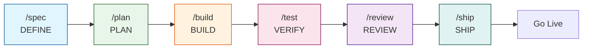

# Spec-Driven Development AI Workspace with OpenCode

**Workspace OpenCode para desarrollo asistido por IA con metodología Spec-Driven Development.**

Una plantilla production-grade que integra 42 skills de ingeniería + 1 meta-skill organizados en 6 fases del ciclo SDD + Extra, comandos slash y agentes especializados para acelerar el desarrollo con IA. Diseñada para equipos y desarrolladores que quieren calidad consistente en proyectos asistidos por IA.

---

## Características

- **42 Skills de Ingeniería + 1 Meta-Skill** — TDD, Spec-Driven Development, Code Review, Seguridad, Performance, UI/UX, DDD/Hexagonal, patrones de diseño, manipulación de spreadsheets, notebooks, y más, organizados en 6 fases SDD + Extra
- **7 Comandos Slash** — `/spec`, `/plan`, `/build`, `/test`, `/review`, `/ship`, `/code-simplify`
- **3 Agentes Principales + 90+ Subagentes** — huitzilopochtli (propósito general), quetzalcoatl (especificaciones), tezcatlipoca (build), y más de 90 subagentes especializados en frontend, backend, DevOps, testing, seguridad, y más
- **Nativo OpenCode** — Comandos slash, agentes y skills cargados desde `.opencode/`
- **Documentación Técnica Integrada** — Referencias de Clean Code, DDD, UI/UX, Testing, Seguridad y más
- **Licencia MIT** — Libre para proyectos personales y comerciales

---

### Agentes Principales

Tres agentes primarios orquestan el ciclo SDD. Cada uno tiene un rol y perspectiva única:

| Agente | Rol | Cuándo usarlo | Ejemplo de aplicación |
|--------|-----|---------------|-----------------------|
| [huitzilopochtli](agents/huitzilopochtli.md) | General Purpose Agent | Tareas de ciclo completo en cualquier dominio — investigar, planificar, organizar, documentar | "Investiga las mejores prácticas de CI/CD y propón un pipeline para este proyecto" |
| [quetzalcoatl](agents/quetzalcoatl.md) | Arquitecto de Especificaciones | Antes de escribir código — analizar, diseñar, planificar, documentar especificaciones | "Diseña la arquitectura del módulo de autenticación y genera una especificación detallada" |
| [tezcatlipoca](agents/tezcatlipoca.md) | Build Agent | Después del análisis — implementar, construir, configurar, ejecutar planes validados | "Implementa la API REST de tareas siguiendo la especificación en specs/tasks-api.md" |

Además, más de **90 subagentes especializados** están disponibles para tareas concretas: revisión de código, auditoría de seguridad, optimización de BD, diseño UI/UX, debugging, y más. Se invocan vía `task()` desde los agentes principales o directamente por el usuario. Ver el [catálogo completo](docs/opencode/09-agent-index.md).

---

## Prerrequisitos

- **Node.js >= 18** y **bun**
- **OpenCode IDE**
- **Git**

---

## Quick Start

### 1. Clona la plantilla
```bash
git clone https://github.com/Fisherk2/spec-driven-develop-opencode-workspace.git mi-proyecto
cd mi-proyecto
```

### 2. Instala dependencias del plugin OpenCode
```bash
cd .opencode && bun install && cd ..
```

### 3. Configura Context7 (documentación actualizada de librerías)
```bash
npx ctx7@latest setup
```

### 4. Instala Excel MCP Server (desarrollo local)
Habilita la manipulación de hojas de cálculo (.xlsx) directamente desde los agentes.

```bash
uvx excel-mcp-server stdio
```

> **Repositorio:** [github.com/haris-musa/excel-mcp-server](https://github.com/haris-musa/excel-mcp-server)

### 5. (Opcional) Jupyter Notebook MCP Server
Habilita automatización de notebooks — ejecutar código, agregar markdown, instalar paquetes e inspeccionar variables en una sesión Jupyter en vivo.

**Requisito:** Inicia un servidor Jupyter primero (Docker o local).

En `opencode.json`, habilita el servidor MCP `jupyter` (cambia `"enabled": false` → `"enabled": true`) y reinicia OpenCode.

> **Repositorio:** [github.com/Cyb3rWard0g/agent-jupyter-toolkit](https://github.com/Cyb3rWard0g/agent-jupyter-toolkit)
>
> **Referencia completa:** [docs/opencode/03-mcp-servers.md](docs/opencode/03-mcp-servers.md#jupyter-notebook----ai-powered-notebook-automation)

### 6. Verifica que los comandos están disponibles
```bash
ls .opencode/commands/
# Deberías ver: build.md  code-simplify.md  plan.md  review.md  ship.md  spec.md  test.md
```

### 7. Ejecuta tu primer workflow SDD completo
```bash
# 1. Define una especificación (DEFINE)
/spec "Crea una API REST de tareas"

# 2. Planifica las tareas (PLAN)
/plan

# 3. Implementa con TDD (BUILD)
/build

# 4. Prueba y verifica (VERIFY)
/test

# 5. Revisa la calidad antes de merge (REVIEW)
/review

# 6. Prepara y despliega a producción (SHIP)
/ship
```

Los skills se activan automáticamente según la fase: diseño de API → [api-and-interface-design](skills/api-and-interface-design/SKILL.md), UI → [frontend-ui-engineering](skills/frontend-ui-engineering/SKILL.md), lógica de dominio → [clean-ddd-hexagonal](skills/clean-ddd-hexagonal/SKILL.md), manejo de errores → [error-handling-patterns](skills/error-handling-patterns/SKILL.md), entre otros.

---

## Flujo de Trabajo



### Ciclo Completo

| Fase | Comando | Skill Principal | Skills Complementarios |
|------|---------|----------------|----------------------|
| Definir | `/spec` | [spec-driven-development](skills/spec-driven-development/SKILL.md) | clean-ddd-hexagonal, design-patterns, architecture-diagrams, ui-ux-design-pro, agent-md-refactor (PRE-FLIGHT), crafting-effective-readmes (PRE-FLIGHT) |
| Planificar | `/plan` | [planning-and-task-breakdown](skills/planning-and-task-breakdown/SKILL.md) | clean-ddd-hexagonal, design-patterns, architecture-diagrams |
| Construir | `/build` | [incremental-implementation](skills/incremental-implementation/SKILL.md) | solid, error-handling-patterns, ui-ux-design-pro, design-taste-frontend, bash-defensive-patterns, clean-ddd-hexagonal |
| Verificar | `/test` | [test-driven-development](skills/test-driven-development/SKILL.md) | error-handling-patterns, design-taste-frontend, incident-response (escalación) |
| Revisar | `/review` | [code-review-and-quality](skills/code-review-and-quality/SKILL.md) | solid, error-handling-patterns, design-patterns, refactoring-patterns, design-taste-frontend |
| Simplificar | `/code-simplify` | [code-simplification](skills/code-simplification/SKILL.md) | refactoring-patterns, solid |
| Lanzar | `/ship` | [shipping-and-launch](skills/shipping-and-launch/SKILL.md) | crafting-effective-readmes, architecture-diagrams, bash-defensive-patterns, incident-response |

---

## Estructura del Proyecto

```
.env.example              # Variables de entorno (plantilla)
AGENTS.md                 # Personas y orquestación de agentes
CONTRIBUTING.md           # Directrices de contribución
USER_GUIDE.md             # Referencia completa de skills
README.md                 # Este archivo

commands/                 # 7 comandos slash para OpenCode
├── spec.md               #   DEFINE
├── plan.md               #   PLAN
├── build.md              #   BUILD
├── test.md               #   VERIFY
├── review.md             #   REVIEW
├── code-simplify.md      #   REVIEW (simplificación)
└── ship.md               #   SHIP

.opencode/                # Configuración principal de OpenCode
├── agents/ → agents/     # Symlink a agents/
├── commands/ → commands/ # Symlink a commands/
├── skills/ → skills/     # Symlink a skills/
└── package.json          # Dependencias del plugin

agents/                   # 3 agentes principales + 90+ subagentes
├── huitzilopochtli.md    #   General Purpose Agent
├── quetzalcoatl.md       #   Arquitecto de especificaciones
├── tezcatlipoca.md       #   Build agent
├── code-reviewer.md      #   Code reviewer
├── security-auditor.md   #   Security engineer
├── test-engineer.md      #   QA specialist
├── database-optimizer.md #   DB specialist
└── ... (catálogo completo en docs/opencode/09-agent-index.md)

skills/                   # 43 skills (42 de ingeniería + 1 meta-skill)
├── using-agent-skills/        # META: descubrimiento de skills
│
├── idea-refine/               # DEFINE
├── spec-driven-development/   # DEFINE
├── agent-md-refactor/         # DEFINE (PRE-FLIGHT)
├── env-setup/                 # DEFINE (PRE-FLIGHT)
├── crafting-effective-readmes/# DEFINE / SHIP
├── clean-ddd-hexagonal/       # DEFINE / PLAN / BUILD
├── design-patterns/           # DEFINE / PLAN / REVIEW
├── architecture-diagrams/     # DEFINE / PLAN / SHIP
├── ui-ux-design-pro/          # DEFINE / BUILD
│
├── planning-and-task-breakdown/ # PLAN
│
├── incremental-implementation/  # BUILD
├── source-driven-development/   # BUILD
├── context-engineering/         # BUILD
├── frontend-ui-engineering/     # BUILD
├── api-and-interface-design/    # BUILD
├── api-spec-generation/         # BUILD
├── docker-optimize/             # BUILD / SHIP
├── db-migration/                # BUILD / SHIP
├── test-driven-development/     # BUILD
├── solid/                       # BUILD / REVIEW
├── clean-code/                  # BUILD / REVIEW
├── error-handling-patterns/     # BUILD / VERIFY / REVIEW
├── design-taste-frontend/       # BUILD / VERIFY / REVIEW
├── bash-defensive-patterns/     # BUILD / SHIP
│
├── browser-testing-with-devtools/ # VERIFY
├── debugging-and-error-recovery/  # VERIFY
│
├── code-review-and-quality/       # REVIEW
├── code-simplification/           # REVIEW
├── security-and-hardening/        # REVIEW
├── dependency-audit/              # REVIEW
├── performance-optimization/      # REVIEW
├── performance-analysis/          # REVIEW
├── refactoring-patterns/          # REVIEW
│
├── git-workflow-and-versioning/   # SHIP
├── changelog-generate/            # SHIP
├── ci-cd-and-automation/          # SHIP
├── deprecation-and-migration/     # SHIP
├── documentation-and-adrs/        # SHIP
├── shipping-and-launch/           # SHIP
├── incident-response/             # SHIP / VERIFY
│
├── xlsx/                          # EXTRA
└── excel-analysis/                # EXTRA

references/               # 59 guías de referencia técnica
├── testing-patterns.md
├── security-checklist.md
├── performance-checklist.md
├── accessibility-checklist.md
├── clean-code.md
├── code-smells.md
├── design-patterns.md
├── solid-principles.md
├── error-handling.md
├── tdd.md
├── architecture.md
├── DDD-STRATEGIC.md
├── DDD-TACTICAL.md
├── HEXAGONAL.md
├── CQRS-EVENTS.md
├── refactoring-smell-catalog.md
├── component-patterns.md
├── color-system.md
├── typography.md
└── ... (59 archivos — ver references/ para la lista completa)

docs/                     # Documentación del proyecto
├── API_REFERENCE.md
├── ARCHITECTURE.md
├── SETUP.md
└── opencode/             # Guías de configuración de OpenCode
    ├── 00-setup.md
    ├── 01-agents.md
    ├── 02-skills.md
    ├── 03-mcp-servers.md
    ├── 04-models.md
    ├── 05-rules.md
    ├── 06-tools-and-custom-tools.md
    ├── 07-permissions.md
    ├── 08-orchestration-patterns.md
    └── 09-agent-index.md

scripts/                  # Scripts auxiliares
specs/                    # Especificaciones del proyecto (SPEC.md)
src/                      # Código fuente del proyecto
tests/                    # Tests del proyecto
```

---

## Configuración

### Personalizar Skills
Cada skill en `skills/` se puede modificar para adaptarlo a tu stack. Ver [CONTRIBUTING.md](CONTRIBUTING.md) para crear skills propios.

### Comandos y Agentes
Los comandos slash y agentes se cargan automáticamente desde `commands/` y `.opencode/agents/`.

---

## Documentación

| Guía | Descripción |
|------|-------------|
| [Guía completa](skills/using-agent-skills/SKILL.md) | Referencia detallada de todos los skills |
| [Guía de agentes](docs/opencode/08-orchestration-patterns.md) | Personas de agentes y orquestación |
| [Contribuir](CONTRIBUTING.md) | Directrices de contribución |

---

## Troubleshooting

| Problema | Causa posible | Solución |
|----------|---------------|----------|
| `/spec` no funciona | Plugin OpenCode no instalado | Ejecuta `cd .opencode && bun install` |
| Context7 da error de cuota | Límite de API alcanzado | Ejecuta `npx ctx7@latest login` o configura `CONTEXT7_API_KEY` |
| Los skills no cargan | Ruta incorrecta | Usa `@skills/<skill-name>/SKILL.md` o carga desde `skills/` |

---

## Licencia

MIT — Ver [LICENSE](LICENSE) para más detalles.

---

## Agradecimientos

Este proyecto no existiría sin el trabajo de:

- **[awesome-opencode](https://github.com/weisser-dev/awesome-opencode)** — Fuente de inspiración para la implementación de nuevas skills, los 90+ agentes especializados y la documentación de OpenCode.
- **[addyosmani/agent-skills](https://github.com/addyosmani/agent-skills)** — Base de este proyecto. Este repositorio es un fork de ese trabajo, que sentó las bases del ecosistema de skills para agentes de IA.

Gracias a sus autores y contribuyentes por su invaluable aporte a la comunidad.

---

*Última revisión: 2026-05-23*
