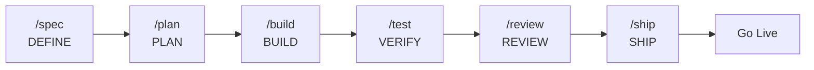

# Complete Reference Guide

**Production-grade engineering skills for AI coding agents.**

---

## Prerequisites

- **Node.js >= 18** and **bun**
- **OpenCode IDE** (see [00-setup.md](docs/opencode/00-setup.md) for configuration)
- **Git**

---

## Quick Start

### 1. Clone and install dependencies

```bash
git clone https://github.com/Fisherk2/spec-driven-develop-opencode-workspace mi-proyecto && cd mi-proyecto
cd .opencode && bun install && cd ..
```

### 2. Configure Context7 (live library docs)

```bash
npx ctx7@latest setup
```

### 3. Install Excel MCP Server (local development)

Enables spreadsheet manipulation (.xlsx) directly from agents.

```bash
uvx excel-mcp-server stdio
```

> **Repository:** [github.com/haris-musa/excel-mcp-server](https://github.com/haris-musa/excel-mcp-server)

### 4. (Optional) Jupyter Notebook MCP Server

Enables AI-powered notebook automation — run code, add markdown, manage packages, and inspect variables in a live Jupyter session.

**Prerequisite:** Start a Jupyter server first (Docker or local).

In `opencode.json`, enable the `jupyter` MCP server (change `"enabled": false` → `"enabled": true`) and restart OpenCode.

> **Repository:** [github.com/Cyb3rWard0g/agent-jupyter-toolkit](https://github.com/Cyb3rWard0g/agent-jupyter-toolkit)
>
> **Full config reference:** [docs/opencode/03-mcp-servers.md](docs/opencode/03-mcp-servers.md#jupyter-notebook----ai-powered-notebook-automation)

### 5. Verify commands

```bash
ls .opencode/commands/
# → build.md  code-simplify.md  plan.md  review.md  ship.md  spec.md  test.md
```

### 6. Run your first SDD workflow

| Step | Command | Phase |
|------|---------|-------|
| Define what to build | `/spec "Create a REST API for tasks"` | DEFINE |
| Plan the tasks | `/plan` | PLAN |
| Implement incrementally | `/build` | BUILD |
| Prove it works | `/test` | VERIFY |
| Review before merge | `/review` | REVIEW |
| Ship to production | `/ship` | SHIP |

Skills activate automatically by phase — API design triggers `api-and-interface-design`, UI work triggers `frontend-ui-engineering`, error handling triggers `error-handling-patterns`, and so on.

---

## Commands

Seven slash commands map to the development lifecycle. Each activates the right skills automatically.

| Action | Command | Principle | Primary Skills Activated |
|--------|---------|-----------|------------------------|
| Define what to build | `/spec` | Spec before code | spec-driven-development, clean-ddd-hexagonal, architecture-diagrams, ui-ux-design-pro |
| Plan how to build it | `/plan` | Small, atomic tasks | planning-and-task-breakdown |
| Build incrementally | `/build` | One slice at a time | incremental-implementation, test-driven-development, solid |
| Prove it works | `/test` | Tests are proof | test-driven-development, browser-testing-with-devtools, debugging-and-error-recovery |
| Review before merge | `/review` | Improve code health | code-review-and-quality, solid, refactoring-patterns |
| Simplify the code | `/code-simplify` | Clarity over cleverness | code-simplification |
| Ship to production | `/ship` | Faster is safer | shipping-and-launch, git-workflow-and-versioning, ci-cd-and-automation, documentation-and-adrs |

For skill discovery guidance, see the [Meta-Skill](skills/using-agent-skills/SKILL.md) — it contains the flowchart mapping task types to the appropriate skill.

---

## SDD Lifecycle



Spec-Driven Development (SDD) is the core workflow: define → plan → build → verify → review → ship. Each phase has dedicated commands and skills with verification gates.

---

## Skills Reference

> **Skill discovery:** Use the [Meta-Skill](skills/using-agent-skills/SKILL.md) to find which skill matches your current task. It contains a **decision tree** mapping task types (implementing code, designing API, UI work, debugging, CI/CD, etc.) to the appropriate skill, plus a **Quick Reference** table summarizing all skills. This is the canonical entry point for task-to-skill navigation.

Skills are organized by SDD phase. Each skill has one canonical entry in its **primary** phase. Skills used across phases include a phase-specific note and link to the primary entry. The Meta-Skill also cross-references every skill with its phases, so you can use it as an index regardless of where you are in the lifecycle.

### Adding a New Skill

1. **Place the skill in the `skills/` folder**
   - Install it manually by creating `skills/<skill-name>/SKILL.md` with the proper format
   - Or install it automatically with `find-skills` (which will download it to the location you specify)
   - Ensure the directory name is kebab-case

2. **Migrate the `references/` directory if it exists**
   - If the skill contains an internal `references/` directory, move **all its contents** to the project's root `references/` folder
   - This keeps reference material centralized and accessible for all skills
   - Delete the empty `references/` directory inside the skill after migrating

3. **Create or adjust the `SKILL.md`** following the format defined in [docs/opencode/02-skills.md](docs/opencode/02-skills.md) (frontmatter, nomenclature, anatomy) and the style guide in [docs/ai-agent-setup/skill-anatomy.md](docs/ai-agent-setup/skill-anatomy.md)

4. **Update the available skills documentation** (priority: meta-skill first):
   - **[skills/using-agent-skills/SKILL.md](skills/using-agent-skills/SKILL.md)** — Add the skill to the "Skill Discovery" tree under the **"Skill Extras"** subsection and to the "Quick Reference" table with phase **"Extra"**
   - **[USER_GUIDE.md](USER_GUIDE.md)** — Add the skill to the appropriate phase table and update the project structure tree

5. **Restart your OpenCode session** so it recognizes the new skill

### Skill Quality Standard

Skills must be:

- **Specific** — Actionable steps, not vague advice
- **Verifiable** — Clear exit criteria with evidence requirements
- **Battle-tested** — Based on real engineering workflows, not theoretical ideals
- **Minimal** — Only the content necessary to guide the agent correctly

### Structure

Every new skill must have:

- [SKILL.md](docs/opencode/02-skills.md) in the skill directory (see anatomy, frontmatter, and nomenclature in that document)
- YAML frontmatter with valid `name` and `description`

For detailed anatomy (Overview, When to Use, Process, etc. sections), see [docs/opencode/02-skills.md](docs/opencode/02-skills.md).

### What Not To Do

- Don't duplicate content between skills — reference other skills instead
- Don't add skills that are vague advice rather than actionable processes
- Don't create support files unless the content exceeds 100 lines
- Don't put reference material inside skill directories — use `references/` instead

---

## Agent Personas

For more information about agent formats, orchestration, and the complete catalog:
- [docs/opencode/01-agents.md](docs/opencode/01-agents.md) — Agent configuration, frontmatter, permissions, modes
- [docs/opencode/08-orchestration-patterns.md](docs/opencode/08-orchestration-patterns.md) — Orchestration patterns and primary agents
- [docs/opencode/09-agent-index.md](docs/opencode/09-agent-index.md) — Complete catalog of agents classified by domain

| Agent | Role | Perspective | Use When |
|-------|------|-------------|----------|
| [huitzilopochtli](agents/huitzilopochtli.md) | General Purpose Agent | Full-lifecycle orchestration | Any task needing research, planning, execution, or organization across domains |
| [quetzalcoatl](agents/quetzalcoatl.md) | Architect of Specifications | Spec-driven analysis, planning, design | Before writing code |
| [tezcatlipoca](agents/tezcatlipoca.md) | Build Agent | Execute validated plans — code, test, configure | After analysis — build features, fix bugs |

### How Personas Relate to Skills and Commands

Three composable layers:

| Layer | What it is | Example | Composition role |
|-------|-----------|---------|------------------|
| **Skill** | A workflow with steps and exit criteria | `code-review-and-quality` | The *how* — mandatory hops when intent matches |
| **Persona** | A role with a perspective and output format | `code-reviewer` | The *who* — adopts a viewpoint, produces a report |
| **Command** | A user-facing entry point | `/review`, `/ship` | The *when* — composes personas and skills |

**Rules:**
- Personas do not invoke other personas. Skills are mandatory hops inside a persona's workflow.
- The only multi-persona pattern is parallel fan-out with merge — used by `/ship`.

### Adding a New Agent

To add a new specialized agent, follow these steps. The project has **two types of agents** with different procedures:

- **Subagent** (~96 currently) — expert in a specific domain, invoked via `task()` from a primary agent
- **Primary agent** (3 currently: huitzilopochtli, quetzalcoatl, tezcatlipoca) — main entry point for slash commands, with ability to delegate to subagents

#### Adding a Subagent

1. **Create `agents/<agent-name>.md`** with the appropriate frontmatter format (simple for review/analysis, extended for execution)

2. **Define the role, scope, output format, and rules**

3. **Add a `## Composition` block at the end** following the standard format (Invoke directly when / Invoke via / Do not invoke from another persona)

4. **Update the global catalog** — Add the agent to the corresponding table in [docs/opencode/09-agent-index.md](docs/opencode/09-agent-index.md):
   - If it's Systems Engineering → add it to the `## 🖥️ Systems Engineering` section
   - If it's Multidisciplinary & Business → add it to the `## 🧩 Multidisciplinary & Business` section

5. **Update the SUBAGENT DELEGATION tables of primary agents** that might delegate to this new agent. This is critical — without this, the primary agent won't know it exists:
   - **[agents/quetzalcoatl.md](agents/quetzalcoatl.md)** — If the agent is useful for analysis, review, specifications, or documentation (code reviews, DB analysis, accessibility, research, etc.)
   - **[agents/tezcatlipoca.md](agents/tezcatlipoca.md)** — If the agent is useful for implementation, build, testing, or deployment (languages, frameworks, DevOps, DB, testing, etc.)
   - Add a row to the table with: agent name, what it does best ("Best for"), and when to delegate ("Delegate when...")

6. **Update the huitzilopochtli catalog** in [agents/huitzilopochtli.md](agents/huitzilopochtli.md):
   - If the agent fits an existing domain (Backend, Frontend, DevOps, etc.), add its name to the comma-separated list
   - If the agent introduces a new domain, add a new row to the "Catalog by Domain" table

7. **Restart your OpenCode session** so it recognizes the new agent

#### Adding a Primary Agent

Primary agents are main entry points in the SDD pipeline. In addition to steps 1-3 from "Adding a Subagent":

4. **Add the agent to the catalog** in [docs/opencode/09-agent-index.md](docs/opencode/09-agent-index.md) (section `## Primary Agents`)

5. **Add the agent to the table** in [docs/opencode/08-orchestration-patterns.md](docs/opencode/08-orchestration-patterns.md) (section `## Agent Personas`)

6. **Update `USER_GUIDE.md`** — Add the agent to the `## Agent Personas` table

7. **Add SUBAGENT DELEGATION section** to the new primary agent, following the pattern of existing ones (table of relevant subagents + delegation rules)

8. **Create necessary hooks in the SDD plugin** (`.opencode/plugins/sdd-pipeline.ts`) if the agent needs:
   - Automatic detection in `AGENT_DETECT_PATTERNS`
   - Role rules in `buildRoleRules()`
   - Tool restrictions in `tool.execute.before`

9. If the agent enables a new orchestration pattern, document it in [docs/opencode/08-orchestration-patterns.md](docs/opencode/08-orchestration-patterns.md)

10. **Restart your OpenCode session**

### Rules for Agents and Subagents

- An agent is a single role with a single output format. If you need a second role, create a second agent.
- **Primary agents can delegate to subagents** via `task()` for specialized, well-defined tasks. Subagents operate in isolated subcontexts and return their result to the primary agent. This is not persona-chaining — it's controlled delegation within the same context.
- **Subagents do NOT delegate to other subagents.** If a subagent needs specialized help, it must report it to the primary agent that invoked it.
- **Primary agents do NOT invoke other primary agents.** Composition between primaries is the responsibility of slash commands or the user.
- An agent can invoke skills (the *how*).
- Every agent file ends with a "Composition" block indicating where it fits.

### File Format

The format and configuration options (YAML frontmatter, modes, permissions, model) are documented in [docs/opencode/01-agents.md](docs/opencode/01-agents.md). Use existing agents in `agents/` as reference.

### What Not To Do

- Don't create agents that invoke other agents
- Don't add multiple roles in a single agent
- Don't duplicate existing functionality

---

## Project Structure

```
project-root/
├── AGENTS.md                   # Agent personas and orchestration
├── USER_GUIDE.md               # This file — complete reference
├── .env.example                # Environment variables template
│
├── commands/                   # 7 slash commands for OpenCode
│   ├── spec.md                 #   DEFINE
│   ├── plan.md                 #   PLAN
│   ├── build.md                #   BUILD
│   ├── test.md                 #   VERIFY
│   ├── review.md               #   REVIEW
│   ├── code-simplify.md        #   REVIEW (simplification)
│   └── ship.md                 #   SHIP
│
├── .opencode/                  # OpenCode config (symlinks → agents/, commands/, skills/)
│
├── agents/                     # 96 agent personas (3 primary + 93 subagents)
│   ├── huitzilopochtli.md      #   General Purpose Agent
│   ├── quetzalcoatl.md         #   Architect of Specifications
│   └── tezcatlipoca.md         #   Build Agent
│
├── skills/                     # 43 skills (42 engineering + 1 meta-skill)
    │   ├── using-agent-skills/     #   META: skill discovery
    │   ├── idea-refine/            #   DEFINE
    │   ├── spec-driven-development/#   DEFINE
    │   ├── agent-md-refactor/      #   DEFINE (PRE-FLIGHT)
    │   ├── env-setup/              #   DEFINE (PRE-FLIGHT)
    │   ├── clean-ddd-hexagonal/    #   DEFINE / PLAN / BUILD
    │   ├── design-patterns/        #   DEFINE / PLAN / REVIEW
    │   ├── architecture-diagrams/  #   DEFINE / PLAN / SHIP
    │   ├── ui-ux-design-pro/       #   DEFINE / BUILD
    │   ├── planning-and-task-breakdown/ # PLAN
    │   ├── incremental-implementation/  # BUILD
    │   ├── test-driven-development/     # BUILD
    │   ├── source-driven-development/   # BUILD
    │   ├── context-engineering/         # BUILD
    │   ├── frontend-ui-engineering/     # BUILD
    │   ├── api-and-interface-design/    # BUILD
    │   ├── api-spec-generation/         # BUILD
    │   ├── docker-optimize/             # BUILD / SHIP
    │   ├── db-migration/                # BUILD / SHIP
    │   ├── solid/                       # BUILD / REVIEW
    │   ├── clean-code/                  # BUILD / REVIEW
    │   ├── error-handling-patterns/     # BUILD / VERIFY / REVIEW
    │   ├── design-taste-frontend/       # BUILD / VERIFY / REVIEW
    │   ├── bash-defensive-patterns/     # BUILD / SHIP
    │   ├── browser-testing-with-devtools/ # VERIFY
    │   ├── debugging-and-error-recovery/  # VERIFY
    │   ├── code-review-and-quality/       # REVIEW
    │   ├── code-simplification/           # REVIEW
    │   ├── security-and-hardening/        # REVIEW
    │   ├── dependency-audit/              # REVIEW
    │   ├── performance-optimization/      # REVIEW
    │   ├── performance-analysis/          # REVIEW
    │   ├── refactoring-patterns/          # REVIEW
    │   ├── git-workflow-and-versioning/   # SHIP
    │   ├── changelog-generate/            # SHIP
    │   ├── ci-cd-and-automation/          # SHIP
    │   ├── deprecation-and-migration/     # SHIP
    │   ├── documentation-and-adrs/        # SHIP
    │   ├── shipping-and-launch/           # SHIP
    │   ├── incident-response/             # SHIP / VERIFY
    │   ├── crafting-effective-readmes/    # DEFINE / SHIP
    │   ├── xlsx/                          # EXTRA
    │   └── excel-analysis/                # EXTRA
    │
├── references/                 # 59 technical reference files
│   ├── testing-patterns.md
│   ├── security-checklist.md
│   ├── performance-checklist.md
│   ├── accessibility-checklist.md
│   ├── clean-code.md
│   ├── code-smells.md
│   ├── design-patterns.md
│   ├── solid-principles.md
│   ├── error-handling.md
│   ├── tdd.md
│   ├── architecture.md
│   ├── DDD-STRATEGIC.md
│   ├── DDD-TACTICAL.md
│   ├── HEXAGONAL.md
│   ├── CQRS-EVENTS.md
│   ├── refactoring-smell-catalog.md
│   ├── component-patterns.md
│   ├── color-system.md
│   ├── typography.md
│   └── ... (59 files total — see references/ for the full list)
│
├── docs/                       # Project documentation
│   ├── API_REFERENCE.md
│   ├── ARCHITECTURE.md
│   ├── SETUP.md
│   └── opencode/               # OpenCode configuration guides
│       ├── 00-setup.md
│       ├── 01-agents.md
│       ├── 02-skills.md
│       ├── 03-mcp-servers.md
│       ├── 04-models.md
│       ├── 05-rules.md
│       ├── 06-tools-and-custom-tools.md
│       ├── 07-permissions.md
│       ├── 08-orchestration-patterns.md
│       └── 09-agent-index.md
│
├── specs/                      # Project specifications (SPEC.md)
├── scripts/                    # Helper scripts
├── src/                        # Source code
└── tests/                      # Tests
```

For OpenCode configuration details (commands, agents, skill loading), see [00-setup.md](docs/opencode/00-setup.md). For skill anatomy (sections, frontmatter, naming), see [02-skills.md](docs/opencode/02-skills.md).

---

## Troubleshooting

| Problem | Possible Cause | Solution |
|---------|---------------|----------|
| `/spec` doesn't work | OpenCode plugin not installed | Run `cd .opencode && bun install` |
| Context7 quota error | API limit reached | Run `npx ctx7@latest login` or set `CONTEXT7_API_KEY` |
| Skills won't load | Wrong path or session not restarted | Use `skills/<skill-name>/SKILL.md` path, then restart OpenCode |
| New skills not recognized | Session cached before install | Restart OpenCode after adding or updating skills in `skills/` |
| Agent not found or not available | Agent disabled or hidden in `opencode.json` | Check `opencode.json` for `"disable": true` or `"hidden": true` on the agent |
| Jupyter MCP won't connect | Server not running or not enabled | Start Jupyter server (Docker/local) first, then set `jupyter.enabled: true` in `opencode.json` and restart |
| Excel MCP won't start | `uvx` not installed or missing dependency | Run `uvx excel-mcp-server stdio` to install automatically; requires Python ≥3.10 |
| Git push fails with "repository moved" | Remote URL points to old repository | Run `git remote set-url origin https://github.com/Fisherk2/spec-driven-develop-opencode-workspace.git` |

## Reporting Issues

Open an [issue](https://github.com/Fisherk2/spec-driven-develop-opencode-workspace/issues) if you find:

- A skill that provides incorrect or outdated guidance
- Missing coverage for a common engineering workflow
- Inconsistencies between skills

---

## Reference

Quick-reference material that skills pull in when needed:

| Document | Covers |
|----------|--------|
| [using-agent-skills (Meta-Skill)](skills/using-agent-skills/SKILL.md) | Skill discovery decision tree, core operating behaviors, failure modes, lifecycle sequence, and Quick Reference table of all skills |
| [testing-patterns.md](references/testing-patterns.md) | Test structure, naming, mocking, React/API/E2E examples, anti-patterns |
| [security-checklist.md](references/security-checklist.md) | Pre-commit checks, auth, input validation, headers, CORS, OWASP Top 10 |
| [performance-checklist.md](references/performance-checklist.md) | Core Web Vitals targets, frontend/backend checklists, measurement commands |
| [accessibility-checklist.md](references/accessibility-checklist.md) | Keyboard nav, screen readers, visual design, ARIA, testing tools |
| [08-orchestration-patterns.md](docs/opencode/08-orchestration-patterns.md) | Agent personas, orchestration patterns, and decision matrix |
| [09-agent-index.md](docs/opencode/09-agent-index.md) | Complete classified catalog of all 96 agents |
| [00-setup.md](docs/opencode/00-setup.md) | OpenCode configuration, commands, agents, skill loading |
| [02-skills.md](docs/opencode/02-skills.md) | Skill creation, format specification, frontmatter, anatomy, naming conventions |

---

## License

MIT — use these skills in your projects, teams, and tools. By contributing, you agree your contributions are licensed under the MIT License.
