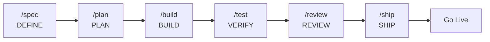

# Complete Reference Guide

> **New to this project?** See the [Quick Start](#quick-start) section below for setup and first workflow.

**Production-grade engineering skills for AI coding agents.**

## Prerequisites

- **Node.js >= 18** and **bun**
- **OpenCode IDE** (→ see [opencode-setup.md](docs/ai-agent-setup/opencode-setup.md) for configuration details)
- **Git**

---

## Table of Contents

- [Complete Reference Guide](#complete-reference-guide)
  - [Table of Contents](#table-of-contents)
  - [Commands](#commands)
    - [Using the Meta-Skill](#using-the-meta-skill)
  - [Quick Start](#quick-start)
  - [All Skills](#all-skills)
    - [Define - Clarify what to build](#define---clarify-what-to-build)
    - [Plan - Break it down](#plan---break-it-down)
    - [Build - Write the code](#build---write-the-code)
    - [Verify - Prove it works](#verify---prove-it-works)
    - [Review - Quality gates before merge](#review---quality-gates-before-merge)
    - [Ship - Deploy with confidence](#ship---deploy-with-confidence)
  - [Agent Personas](#agent-personas)
    - [When to Use Each](#when-to-use-each)
    - [How Personas Relate to Skills and Commands](#how-personas-relate-to-skills-and-commands)
  - [Reference Checklists](#reference-checklists)
  - [How Skills Work](#how-skills-work)
  - [Project Structure](#project-structure)
  - [Template-Specific Tools](#template-specific-tools)
    - [Context7 (ctx7)](#context7-ctx7)
    - [Available Skills](#available-skills)
  - [Why Agent Skills?](#why-agent-skills)
  - [Troubleshooting](#troubleshooting)
  - [Adding a New Skill](#adding-a-new-skill)
  - [Adding a New Agent](#adding-a-new-agent)
  - [License](#license)
  - [Related Documentation](#related-documentation)
    - [Getting Started](#getting-started)
    - [Agent Configuration](#agent-configuration)
    - [Platform Setup](#platform-setup)
    - [Reference Checklists](#reference-checklists-1)



---

## Commands

7 slash commands that map to the development lifecycle. Each one activates the right skills automatically.

| What you're doing | Command | Key principle | Complementary Skills |
|-------------------|---------|---------------|---------------------|
| Define what to build | `/spec` | Spec before code | clean-ddd-hexagonal, design-patterns, architecture-diagrams, ui-ux-design-pro, agent-md-refactor (PRE-FLIGHT), crafting-effective-readmes (PRE-FLIGHT) |
| Plan how to build it | `/plan` | Small, atomic tasks | clean-ddd-hexagonal, design-patterns, architecture-diagrams |
| Build incrementally | `/build` | One slice at a time | solid, error-handling-patterns, ui-ux-design-pro, design-taste-frontend, bash-defensive-patterns, clean-ddd-hexagonal |
| Prove it works | `/test` | Tests are proof | error-handling-patterns, design-taste-frontend, incident-response (escalation) |
| Review before merge | `/review` | Improve code health | solid, error-handling-patterns, design-patterns, refactoring-patterns, design-taste-frontend |
| Simplify the code | `/code-simplify` | Clarity over cleverness | refactoring-patterns, solid |
| Ship to production | `/ship` | Faster is safer | crafting-effective-readmes, architecture-diagrams, bash-defensive-patterns, incident-response |

Skills also activate automatically based on what you're doing — designing an API triggers `api-and-interface-design`, building UI triggers `frontend-ui-engineering`, domain logic triggers `clean-ddd-hexagonal`, error handling triggers `error-handling-patterns`, and so on.

### Using the Meta-Skill

Start with [skills/using-agent-skills/SKILL.md](skills/using-agent-skills/SKILL.md) to discover which skill applies to your current task. This meta-skill contains:

- A **flowchart** that maps task types to the appropriate skill
- **Core operating behaviors** (surface assumptions, manage confusion, push back when warranted, enforce simplicity)
- **Failure modes** to avoid
- **Lifecycle sequences** for complete features

---

## Quick Start

### 1. Clone the template
```bash
git clone <your-repo-url> mi-proyecto
cd mi-proyecto
```

### 2. Install OpenCode plugin dependencies
```bash
cd .opencode && bun install && cd ..
```

### 3. Configure Context7 (up-to-date library documentation)
```bash
npx ctx7@latest setup
```

### 4. Verify commands are available
```bash
ls .opencode/commands/
# Should see: build.md  code-simplify.md  plan.md  review.md  ship.md  spec.md  test.md
```

### 5. Run your first complete SDD workflow
```bash
# 1. Define a specification (DEFINE)
/spec "Create a REST API for tasks"

# 2. Plan the tasks (PLAN)
/plan

# 3. Implement with TDD (BUILD)
/build

# 4. Test and verify (VERIFY)
/test

# 5. Review quality before merge (REVIEW)
/review

# 6. Prepare and deploy to production (SHIP)
/ship
```

Skills activate automatically based on the phase: API design → `api-and-interface-design`, UI → `frontend-ui-engineering`, domain logic → `clean-ddd-hexagonal`, error handling → `error-handling-patterns`, among others.

> **OpenCode configuration details?** See [opencode-setup.md](docs/ai-agent-setup/opencode-setup.md) for setup, commands, agents, and skill loading.

---

## All Skills

The commands above are the entry points. Under the hood, they activate all the skills listed below — each one a structured workflow with steps, verification gates, and anti-rationalization tables. The skills are organized by phase below.

> **For detailed information on how skills work, see [skills/using-agent-skills/SKILL.md](skills/using-agent-skills/SKILL.md).**

### Define - Clarify what to build

| Skill | What It Does | Use When |
|-------|-------------|----------|
| [idea-refine](skills/idea-refine/SKILL.md) | Structured divergent/convergent thinking to turn vague ideas into concrete proposals | You have a rough concept that needs exploration |
| [spec-driven-development](skills/spec-driven-development/SKILL.md) | Write a PRD covering objectives, commands, structure, code style, testing, and boundaries before any code | Starting a new project, feature, or significant change |
| [agent-md-refactor](skills/agent-md-refactor/SKILL.md) | Refactor bloated agent instruction files (AGENTS.md, CLAUDE.md) following progressive disclosure | Your AGENTS.md is too long (>200 lines), contradictory, or hard to maintain (PRE-FLIGHT in `/spec`) |
| [crafting-effective-readmes](skills/crafting-effective-readmes/SKILL.md) | Write or improve READMEs matching your audience (OSS, internal, personal, config) | Writing or improving README files (PRE-FLIGHT in `/spec` if no README exists) |
| [clean-ddd-hexagonal](skills/clean-ddd-hexagonal/SKILL.md) | Combine Clean Architecture, DDD tactical patterns, and Hexagonal ports/adapters | Designing APIs, microservices, or complex backend domains |
| [design-patterns](skills/design-patterns/SKILL.md) | Apply GoF and enterprise design patterns matching the problem context | Solving recurring design problems, refactoring, or reviewing structure |
| [architecture-diagrams](skills/architecture-diagrams/SKILL.md) | Create system architecture diagrams using Mermaid, PlantUML, C4 model, and flowcharts | Documenting architecture, designing systems, or creating technical documentation |
| [ui-ux-design-pro](skills/ui-ux-design-pro/SKILL.md) | Professional UI/UX design with design systems, tokens, palettes, and high-fidelity prototyping | Designing user interfaces, dashboards, or applications with high visual quality |

### Plan - Break it down

| Skill | What It Does | Use When |
|-------|-------------|----------|
| [planning-and-task-breakdown](skills/planning-and-task-breakdown/SKILL.md) | Decompose specs into small, verifiable tasks with acceptance criteria and dependency ordering | You have a spec and need implementable units |
| [clean-ddd-hexagonal](skills/clean-ddd-hexagonal/SKILL.md) | Combine Clean Architecture, DDD tactical patterns, and Hexagonal ports/adapters | Decomposing backend modules or designing domain logic |
| [design-patterns](skills/design-patterns/SKILL.md) | Apply GoF and enterprise design patterns matching the problem context | Defining implementation patterns or solving design problems during planning |
| [architecture-diagrams](skills/architecture-diagrams/SKILL.md) | Create system architecture diagrams using Mermaid, PlantUML, C4 model, and flowcharts | Visualizing dependencies, flows, or system architecture during planning |

### Build - Write the code

| Skill | What It Does | Use When |
|-------|-------------|----------|
| [incremental-implementation](skills/incremental-implementation/SKILL.md) | Thin vertical slices - implement, test, verify, commit. Feature flags, safe defaults, rollback-friendly changes | Any change touching more than one file |
| [test-driven-development](skills/test-driven-development/SKILL.md) | Red-Green-Refactor, test pyramid (80/15/5), test sizes, DAMP over DRY, Beyonce Rule, browser testing | Implementing logic, fixing bugs, or changing behavior |
| [context-engineering](skills/context-engineering/SKILL.md) | Feed agents the right information at the right time - rules files, context packing, MCP integrations | Starting a session, switching tasks, or when output quality drops |
| [source-driven-development](skills/source-driven-development/SKILL.md) | Ground every framework decision in official documentation - verify, cite sources, flag what's unverified | You want authoritative, source-cited code for any framework or library |
| [frontend-ui-engineering](skills/frontend-ui-engineering/SKILL.md) | Component architecture, design systems, state management, responsive design, WCAG 2.1 AA accessibility | Building or modifying user-facing interfaces |
| [api-and-interface-design](skills/api-and-interface-design/SKILL.md) | Contract-first design, Hyrum's Law, One-Version Rule, error semantics, boundary validation | Designing APIs, module boundaries, or public interfaces |
| [solid](skills/solid/SKILL.md) | Apply SOLID principles, TDD, clean code, and professional software design | Writing, refactoring, or reviewing any code |
| [error-handling-patterns](skills/error-handling-patterns/SKILL.md) | Master error handling patterns including exceptions, Result types, and graceful degradation | Implementing error handling, designing resilient APIs, or improving reliability |
| [ui-ux-design-pro](skills/ui-ux-design-pro/SKILL.md) | Professional UI/UX design with design systems, tokens, palettes, and high-fidelity prototyping | Implementing UI from design specifications or improving existing UI |
| [design-taste-frontend](skills/design-taste-frontend/SKILL.md) | Metric-based visual consistency rules to override default LLM biases | Validating visual consistency, spacing, typography, and design quality in frontend |
| [bash-defensive-patterns](skills/bash-defensive-patterns/SKILL.md) | Apply defensive Bash scripting patterns (strict mode, traps, safe variable handling) | Writing robust shell scripts, CI/CD pipelines, or system utilities |
| [clean-ddd-hexagonal](skills/clean-ddd-hexagonal/SKILL.md) | Combine Clean Architecture, DDD tactical patterns, and Hexagonal ports/adapters | Implementing domain logic or backend services using DDD patterns |

### Verify - Prove it works

| Skill | What It Does | Use When |
|-------|-------------|----------|
| [browser-testing-with-devtools](skills/browser-testing-with-devtools/SKILL.md) | Chrome DevTools MCP for live runtime data - DOM inspection, console logs, network traces, performance profiling | Building or debugging anything that runs in a browser |
| [debugging-and-error-recovery](skills/debugging-and-error-recovery/SKILL.md) | Five-step triage: reproduce, localize, reduce, fix, guard. Stop-the-line rule, safe fallbacks | Tests fail, builds break, or behavior is unexpected |
| [error-handling-patterns](skills/error-handling-patterns/SKILL.md) | Master error handling patterns including exceptions, Result types, and graceful degradation | Testing error paths, resilience, or edge cases |
| [design-taste-frontend](skills/design-taste-frontend/SKILL.md) | Metric-based visual consistency rules to override default LLM biases | Verifying visual consistency, spacing, typography, and design quality in frontend |

### Review - Quality gates before merge

| Skill | What It Does | Use When |
|-------|-------------|----------|
| [code-review-and-quality](skills/code-review-and-quality/SKILL.md) | Five-axis review, change sizing (~100 lines), severity labels (Nit/Optional/FYI), review speed norms, splitting strategies | Before merging any change |
| [code-simplification](skills/code-simplification/SKILL.md) | Chesterton's Fence, Rule of 500, reduce complexity while preserving exact behavior | Code works but is harder to read or maintain than it should be |
| [security-and-hardening](skills/security-and-hardening/SKILL.md) | OWASP Top 10 prevention, auth patterns, secrets management, dependency auditing, three-tier boundary system | Handling user input, auth, data storage, or external integrations |
| [performance-optimization](skills/performance-optimization/SKILL.md) | Measure-first approach - Core Web Vitals targets, profiling workflows, bundle analysis, anti-pattern detection | Performance requirements exist or you suspect regressions |
| [solid](skills/solid/SKILL.md) | Apply SOLID principles, TDD, clean code, and professional software design | Evaluating code quality, maintainability, or design principles |
| [error-handling-patterns](skills/error-handling-patterns/SKILL.md) | Master error handling patterns including exceptions, Result types, and graceful degradation | Reviewing error handling, resilience, or API contracts |
| [design-patterns](skills/design-patterns/SKILL.md) | Apply GoF and enterprise design patterns matching the problem context | Reviewing code structure, design patterns, or architectural decisions |
| [refactoring-patterns](skills/refactoring-patterns/SKILL.md) | Apply named refactoring transformations to improve code structure without changing behavior | Code needs structural improvement, code smells present, or preparing for new features |
| [design-taste-frontend](skills/design-taste-frontend/SKILL.md) | Metric-based visual consistency rules to override default LLM biases | Reviewing frontend for visual consistency, spacing, typography, or design quality |

### Ship - Deploy with confidence

| Skill | What It Does | Use When |
|-------|-------------|----------|
| [git-workflow-and-versioning](skills/git-workflow-and-versioning/SKILL.md) | Trunk-based development, atomic commits, change sizing (~100 lines), the commit-as-save-point pattern | Making any code change (always) |
| [ci-cd-and-automation](skills/ci-cd-and-automation/SKILL.md) | Shift Left, Faster is Safer, feature flags, quality gate pipelines, failure feedback loops | Setting up or modifying build and deploy pipelines |
| [deprecation-and-migration](skills/deprecation-and-migration/SKILL.md) | Code-as-liability mindset, compulsory vs advisory deprecation, migration patterns, zombie code removal | Removing old systems, migrating users, or sunsetting features |
| [documentation-and-adrs](skills/documentation-and-adrs/SKILL.md) | Architecture Decision Records, API docs, inline documentation standards - document the *why* | Making architectural decisions, changing APIs, or shipping features |
| [shipping-and-launch](skills/shipping-and-launch/SKILL.md) | Pre-launch checklists, feature flag lifecycle, staged rollouts, rollback procedures, monitoring setup | Preparing to deploy to production |
| [crafting-effective-readmes](skills/crafting-effective-readmes/SKILL.md) | Write or improve READMEs matching your audience (OSS, internal, personal, config) | Generating or updating README files for documentation |
| [architecture-diagrams](skills/architecture-diagrams/SKILL.md) | Create system architecture diagrams using Mermaid, PlantUML, C4 model, and flowcharts | Documenting final architecture, system design, or technical workflows |
| [bash-defensive-patterns](skills/bash-defensive-patterns/SKILL.md) | Apply defensive Bash scripting patterns (strict mode, traps, safe variable handling) | Writing robust CI/CD scripts, deployment scripts, or system utilities |
| [incident-response](skills/incident-response/SKILL.md) | Run incident response workflow — triage, communicate, and write blameless postmortem | Handling production incidents, triaging alerts, or managing post-launch issues |

---

## Agent Personas

> **For detailed information on how agents work, see [references/orchestration-patterns.md](references/orchestration-patterns.md).**

Pre-configured specialist personas for targeted reviews:

| Agent | Role | Perspective | Use When |
|-------|------|-------------|----------|
| [code-reviewer](agents/code-reviewer.md) | Senior Staff Engineer | Five-axis code review with "would a staff engineer approve this?" standard | Before merging any change |
| [test-engineer](agents/test-engineer.md) | QA Specialist | Test strategy, coverage analysis, and the Prove-It pattern | Writing tests or analyzing coverage |
| [security-auditor](agents/security-auditor.md) | Security Engineer | Vulnerability detection, threat modeling, OWASP assessment | Security-sensitive changes |
| [analysis](agents/analysis.md) | Architect of Specifications | Spec-Driven Analysis, planning, and design | Before writing code — analyze, design, or plan |
| [implement](agents/implement.md) | Build Agent | Execute validated execution plans — code, test, configure, and document | After analysis — execute the plan, build features, or fix bugs |

### When to Use Each

- **Direct invocation**: When you want one perspective on a single artifact
  - "Review this PR" → invoke [code-reviewer](agents/code-reviewer.md)
  - "Check for security issues" → invoke [security-auditor](agents/security-auditor.md)
  - "What tests are missing?" → invoke [test-engineer](agents/test-engineer.md)
  - "Analyze this feature and create a plan" → invoke [analysis](agents/analysis.md)
  - "Build this feature from the plan" → invoke [implement](agents/implement.md)

- **Via commands**: When there's a repeatable workflow
  - `/build` → wraps [implement](agents/implement.md) with incremental-implementation and TDD skills
  - `/test` → wraps [implement](agents/implement.md) with TDD skill
  - `/code-simplify` → wraps [implement](agents/implement.md) with code-simplification skill
  - `/review` → wraps [code-reviewer](agents/code-reviewer.md) with the project's review skill
  - `/ship` → fans out to all three review personas in parallel, then synthesizes reports

### How Personas Relate to Skills and Commands

Three composable layers, each with a distinct job:

| Layer | What it is | Example | Composition role |
|-------|-----------|---------|------------------|
| **Skill** | A workflow with steps and exit criteria | `code-review-and-quality` | The *how* — mandatory hops when an intent matches |
| **Persona** | A role with a perspective and output format | `code-reviewer` | The *who* — adopts a viewpoint, produces a report |
| **Command** | A user-facing entry point | `/review`, `/ship` | The *when* — composes personas and skills |

**Rules:**
- **Personas do not invoke other personas.** Skills are mandatory hops inside a persona's workflow.
- The only multi-persona pattern endorsed is **parallel fan-out with a merge step** — used by `/ship` to run all three personas concurrently.

> **For detailed orchestration patterns and decision matrix, see [references/orchestration-patterns.md](references/orchestration-patterns.md).**

---

## Reference Checklists

Quick-reference material that skills pull in when needed:

| Reference | Covers |
|-----------|--------|
| [testing-patterns.md](references/testing-patterns.md) | Test structure, naming, mocking, React/API/E2E examples, anti-patterns |
| [security-checklist.md](references/security-checklist.md) | Pre-commit checks, auth, input validation, headers, CORS, OWASP Top 10 |
| [performance-checklist.md](references/performance-checklist.md) | Core Web Vitals targets, frontend/backend checklists, measurement commands |
| [accessibility-checklist.md](references/accessibility-checklist.md) | Keyboard nav, screen readers, visual design, ARIA, testing tools |

---

## How Skills Work

Every skill is a structured workflow with steps, verification gates, and anti-rationalization tables. They are designed to encode the same discipline senior engineers bring to production code.

> **📖 For the complete skill anatomy (diagram, section purposes, frontmatter format, writing principles, and naming conventions):** see [docs/ai-agent-setup/skill-anatomy.md](docs/ai-agent-setup/skill-anatomy.md).

---

## Project Structure

```
project-root/
├── .env.example              # Environment variables (template)
├── AGENTS.md                 # Agent personas and orchestration
├── references/orchestration-patterns.md  # Agent personas and orchestration
├── USER_GUIDE.md             # This file — complete reference
├── CONTRIBUTING.md           # Contribution guidelines
│
├── commands/                 # 7 slash commands for OpenCode
│   ├── spec.md               #   DEFINE
│   ├── plan.md               #   PLAN
│   ├── build.md              #   BUILD
│   ├── test.md               #   VERIFY
│   ├── review.md             #   REVIEW
│   ├── code-simplify.md      #   REVIEW (simplification)
│   └── ship.md               #   SHIP
│
├── .opencode/                # OpenCode main configuration (→ [config details](docs/ai-agent-setup/opencode-setup.md))
│   ├── agents/ → agents/     #   Symlink to agents/
│   ├── commands/ → commands/ #   Symlink to commands/
│   ├── skills/ → skills/     #   Symlink to skills/
│   └── package.json          #   Plugin dependencies
│
├── agents/                   # 5 specialized agent personas
│   ├── analysis.md           #   Architect of Specifications
│   ├── implement.md          #   Build Agent
│   ├── code-reviewer.md      #   Senior Staff Engineer
│   ├── test-engineer.md      #   QA Specialist
│   └── security-auditor.md   #   Security Engineer
│
├── skills/                   # 33 skills organized by SDD phase
│   │
│   ├── idea-refine/              # DEFINE
│   ├── spec-driven-development/  # DEFINE
│   ├── agent-md-refactor/        # DEFINE (PRE-FLIGHT)
│   ├── crafting-effective-readmes/ # DEFINE/SHIP
│   ├── clean-ddd-hexagonal/      # DEFINE/PLAN/BUILD
│   ├── design-patterns/          # DEFINE/PLAN/REVIEW
│   ├── architecture-diagrams/    # DEFINE/PLAN/SHIP
│   ├── ui-ux-design-pro/         # DEFINE/BUILD
│   │
│   ├── planning-and-task-breakdown/ # PLAN
│   │
│   ├── incremental-implementation/  # BUILD
│   ├── context-engineering/         # BUILD
│   ├── source-driven-development/   # BUILD
│   ├── frontend-ui-engineering/     # BUILD
│   ├── api-and-interface-design/    # BUILD
│   ├── test-driven-development/     # BUILD
│   ├── solid/                       # BUILD/REVIEW
│   ├── error-handling-patterns/     # BUILD/VERIFY/REVIEW
│   ├── design-taste-frontend/       # BUILD/VERIFY/REVIEW
│   ├── bash-defensive-patterns/     # BUILD/SHIP
│   │
│   ├── browser-testing-with-devtools/ # VERIFY
│   ├── debugging-and-error-recovery/  # VERIFY
│   │
│   ├── code-review-and-quality/       # REVIEW
│   ├── code-simplification/           # REVIEW
│   ├── security-and-hardening/        # REVIEW
│   ├── performance-optimization/      # REVIEW
│   ├── refactoring-patterns/          # REVIEW
│   │
│   ├── git-workflow-and-versioning/   # SHIP
│   ├── ci-cd-and-automation/          # SHIP
│   ├── deprecation-and-migration/     # SHIP
│   ├── documentation-and-adrs/        # SHIP
│   ├── shipping-and-launch/           # SHIP
│   ├── incident-response/             # VERIFY/SHIP
│   │
│   └── using-agent-skills/            # META: skill discovery
│
├── references/               # Technical reference checklists
│   ├── testing-patterns.md
│   ├── security-checklist.md
│   ├── performance-checklist.md
│   ├── accessibility-checklist.md
│   └── orchestration-patterns.md
│
├── docs/                     # Project documentation
│   ├── ai-agent-setup/
│   │   ├── opencode-setup.md
│   │   ├── prompt-anatomy.md
│   │   └── skill-anatomy.md
│   └── decisions/            # ADRs (Architecture Decision Records)
│
├── scripts/                  # Helper scripts
├── specs/                    # Project specifications (SPEC.md)
├── src/                      # Source code
└── tests/                    # Tests
```

---

## Template-Specific Tools

This template includes tools that enhance AI-assisted development:

### Context7 (ctx7)

**Purpose:** Fetch up-to-date documentation for any library, framework, or SDK.

**Installation:**
```bash
npx ctx7@latest setup
```

**Usage:** The `find-docs` skill is automatically invoked when you ask about API syntax, configuration options, or how to use a specific technology. You can also use it directly:

```bash
npx ctx7@latest library <library-name> "<query>"
npx ctx7@latest docs <library-id> "<query>"
```

### Available Skills

This template includes several skills for documentation and development:

| Skill | Purpose | Use When |
|-------|---------|----------|
| [source-driven-development](skills/source-driven-development/SKILL.md) | Ground implementation in official docs | Building with any framework or library |
| [crafting-effective-readmes](skills/crafting-effective-readmes/SKILL.md) | Write or improve READMEs for any project type | Writing or improving README files |
| [design-patterns](skills/design-patterns/SKILL.md) | Apply GoF and enterprise design patterns | Solving recurring design problems |
| [solid](skills/solid/SKILL.md) | Apply SOLID principles and clean code | Writing, refactoring, or reviewing code |
| [clean-ddd-hexagonal](skills/clean-ddd-hexagonal/SKILL.md) | Clean Architecture + DDD + Hexagonal patterns | Designing APIs, microservices, or complex backends |
| [bash-defensive-patterns](skills/bash-defensive-patterns/SKILL.md) | Defensive Bash scripting (strict mode, traps, safe variable handling) | Writing robust shell scripts or CI/CD pipelines |
| [agent-md-refactor](skills/agent-md-refactor/SKILL.md) | Refactor bloated agent instruction files | Your AGENTS.md is too long or contradictory |

---

## Troubleshooting

| Problem | Possible Cause | Solution |
|---------|---------------|----------|
| `/spec` doesn't work | OpenCode plugin not installed | Run `cd .opencode && bun install` |
| Context7 quota error | API limit reached | Run `npx ctx7@latest login` or set `CONTEXT7_API_KEY` |
| Skills won't load | Wrong path | Use `@skills/<skill-name>/SKILL.md` or load from `skills/` |

---

## Why Agent Skills?

AI coding agents default to the shortest path - which often means skipping specs, tests, security reviews, and the practices that make software reliable. Agent Skills gives agents structured workflows that enforce the same discipline senior engineers bring to production code.

Each skill encodes hard-won engineering judgment: *when* to write a spec, *what* to test, *how* to review, and *when* to ship. These aren't generic prompts - they're the kind of opinionated, process-driven workflows that separate production-quality work from prototype-quality work.

Skills bake in best practices from Google's engineering culture — including concepts from [Software Engineering at Google](https://abseil.io/resources/swe-book) and Google's [engineering practices guide](https://google.github.io/eng-practices/). You'll find Hyrum's Law in API design, the Beyonce Rule and test pyramid in testing, change sizing and review speed norms in code review, Chesterton's Fence in simplification, trunk-based development in git workflow, Shift Left and feature flags in CI/CD, and a dedicated deprecation skill treating code as a liability. These aren't abstract principles — they're embedded directly into the step-by-step workflows agents follow.

---

## Adding a New Skill

1. **Place the skill in the `skills/` folder**
   - Install manually by creating `skills/<skill-name>/SKILL.md` with the proper format
   - Or install automatically via `find-skills` (which will download to your specified location)
   - Ensure the directory name is kebab-case

2. **Migrate the `references/` directory if present**
   - If the skill contains an internal `references/` directory, move **all its content** to the project root's `references/` folder
   - This keeps reference material centralized and accessible to all skills
   - Delete the now-empty `references/` directory inside the skill after migration

3. **Create or adjust the `SKILL.md`** following the format in [docs/ai-agent-setup/skill-anatomy.md](docs/ai-agent-setup/skill-anatomy.md)
   - Include YAML frontmatter with `name` and `description` fields
   - The `description` should briefly state what the skill does, followed by "Use when" trigger conditions

4. **Update the skills documentation** (priority: meta-skill first):
   - **[skills/using-agent-skills/SKILL.md](skills/using-agent-skills/SKILL.md)** — Add the skill to the "Skill Discovery" tree under the **"Skill Extras"** subsection and to the "Quick Reference" table with the **"Extra"** phase
   - **[USER_GUIDE.md](USER_GUIDE.md)** — Add the skill to the appropriate phase table and update the project structure tree

5. **Restart your OpenCode session** so it recognizes the new skill

### Skill Quality Standards

Skills must be:

- **Specific** — Actionable steps, not vague advice
- **Verifiable** — Clear exit criteria with evidence requirements
- **Battle-tested** — Based on real engineering workflows, not theoretical ideals
- **Minimal** — Only the content needed to guide the agent correctly

### Skill Structure

Every new skill must have a [SKILL.md](docs/ai-agent-setup/skill-anatomy.md) file with valid YAML frontmatter.

> **📖 For the complete skill anatomy (standard sections, frontmatter format, supporting files, writing principles, and naming conventions):** see [docs/ai-agent-setup/skill-anatomy.md](docs/ai-agent-setup/skill-anatomy.md).

### Quick Reference

- Create `skills/{skill-name}/SKILL.md` with kebab-case naming
- Keep SKILL.md **under 500 lines**; use progressive disclosure for detailed content
- **Reference** other skills instead of duplicating content
- Put reference material in `references/` at project root, not inside skill directories

### What Not to Do

- Do not duplicate content between skills — reference other skills instead
- Do not add skills that are vague advice instead of actionable processes
- Do not create support files unless content exceeds 100 lines
- Do not put reference material inside skill directories — use `references/`

---

## Adding a New Agent

To add a new specialized agent, follow these steps:

### Steps

1. Create `agents/<agent-name>.md` with the same frontmatter format as existing agents
2. Define the role, scope, output format, and rules
3. Add a **Composition** block at the end (Invoke directly when / Invoke via / Do not invoke from another persona)
4. Add the agent to the table in [references/orchestration-patterns.md](references/orchestration-patterns.md)
5. Update the `## Agent Personas` section in this document with the new agent
6. If the agent enables a new orchestration pattern, document it in [references/orchestration-patterns.md](references/orchestration-patterns.md)

### Agent Rules

- An agent is a single role with a single output format. If you need a second role, create a second agent.
- **Agents do not invoke other agents.** Composition is the job of commands or the user.
- An agent may invoke skills (the *how*).
- Every agent file ends with a "Composition" block indicating where it fits.

### Agent Structure

```
agents/
  <agent-name>.md    # Frontmatter format:
                      # ---
                      # name: agent-name
                      # role: Role title
                      # perspective: Specialized perspective
                      # ---
                      #
                      # [Agent content]
                      #
                      # ## Composition
                      # [Where this agent is invoked]
```

### Frontmatter Examples

The project supports two frontmatter formats:

**Simple format** (review/QA/security agents):
```yaml
---
name: code-reviewer
description: Senior code reviewer that evaluates changes across five dimensions — correctness, readability, architecture, security, and performance
---
```

**Extended OpenCode format** (agents requiring permission and model configuration):
```yaml
---
description: Build Agent - Execute Plans (Write/Edit Enabled)
mode: primary
color: "#FF55FF"
model: opencode/qwen3.6-plus-free
temperature: 0.9
permission:
  write: allow
  edit: allow
  read: allow
  bash: ask
---
```

Use simple format for purely analytical or review agents, and extended format for agents with write permissions and platform-specific configuration.

### Existing Agents

| Agent | Role | Purpose |
|-------|------|---------|
| [analysis](agents/analysis.md) | Architect of Specifications | Transforms ideas and requirements into detailed execution plans without generating code |
| [implement](agents/implement.md) | Build Agent | Executes validated implementation plans — build, test, and modify code |
| [code-reviewer](agents/code-reviewer.md) | Senior Staff Engineer | Five-axis review before merge |
| [security-auditor](agents/security-auditor.md) | Security Engineer | Vulnerability detection, OWASP assessment |
| [test-engineer](agents/test-engineer.md) | QA Engineer | Test strategy, coverage analysis, Prove-It pattern |

### What Not to Do

- Do not create agents that invoke other agents
- Do not add multiple roles in a single agent
- Do not duplicate existing functionality

---

## License

MIT - use these skills in your projects, teams, and tools.

---

## Related Documentation

For specialized topics, see these guides:

### Getting Started
| Document | Covers |
|----------|--------|
| [docs/ai-agent-setup/skill-anatomy.md](docs/ai-agent-setup/skill-anatomy.md) | Complete guide for creating new skills |

### Agent Configuration
| Document | Covers |
|----------|--------|
| [references/orchestration-patterns.md](references/orchestration-patterns.md) | Agent personas, orchestration patterns, and decision matrix (merged from AGENTS_GUIDE.md) |

### Setup & Reference
| Document | Covers |
|----------|--------|
| [docs/ai-agent-setup/opencode-setup.md](docs/ai-agent-setup/opencode-setup.md) | OpenCode configuration, slash commands, agents, and skill loading |
| [docs/ai-agent-setup/prompt-anatomy.md](docs/ai-agent-setup/prompt-anatomy.md) | Prompt templates and workflow for AI agents |
| [docs/ai-agent-setup/skill-anatomy.md](docs/ai-agent-setup/skill-anatomy.md) | Skill creation guide and format specification |

### Reference Checklists
| Document | Covers |
|----------|--------|
| [references/testing-patterns.md](references/testing-patterns.md) | Test structure, naming, mocking, examples |
| [references/security-checklist.md](references/security-checklist.md) | Security best practices, OWASP Top 10 |
| [references/performance-checklist.md](references/performance-checklist.md) | Core Web Vitals, performance optimization |
| [references/accessibility-checklist.md](references/accessibility-checklist.md) | WCAG 2.1 AA, keyboard nav, screen readers |
