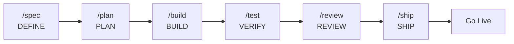

# Complete Reference Guide

**Production-grade engineering skills for AI coding agents.**

---

## Prerequisites

- **Node.js >= 18** and **bun**
- **OpenCode IDE** (see [00-setup.md](docs/opencode/00-setup.md) for configuration)
- **Git**

---

## Quick Start

### 1. Clone and install dependencies

```bash
git clone https://github.com/Fisherk2/spec-driven-develop-opencode-workspace mi-proyecto && cd mi-proyecto
cd .opencode && bun install && cd ..
```

### 2. Configure Context7 (live library docs)

```bash
npx ctx7@latest setup
```

### 3. Install Excel MCP Server (local development)

Enables spreadsheet manipulation (.xlsx) directly from agents.

```bash
uvx excel-mcp-server stdio
```

> **Repository:** [github.com/haris-musa/excel-mcp-server](https://github.com/haris-musa/excel-mcp-server)

### 4. (Optional) Jupyter Notebook MCP Server

Enables AI-powered notebook automation — run code, add markdown, manage packages, and inspect variables in a live Jupyter session.

**Prerequisite:** Start a Jupyter server first (Docker or local).

In `opencode.json`, enable the `jupyter` MCP server (change `"enabled": false` → `"enabled": true`) and restart OpenCode.

> **Repository:** [github.com/Cyb3rWard0g/agent-jupyter-toolkit](https://github.com/Cyb3rWard0g/agent-jupyter-toolkit)
>
> **Full config reference:** [docs/opencode/03-mcp-servers.md](docs/opencode/03-mcp-servers.md#jupyter-notebook----ai-powered-notebook-automation)

### 5. Verify commands

```bash
ls .opencode/commands/
# → build.md  code-simplify.md  plan.md  review.md  ship.md  spec.md  test.md
```

### 6. Run your first SDD workflow

| Step | Command | Phase |
|------|---------|-------|
| Define what to build | `/spec "Create a REST API for tasks"` | DEFINE |
| Plan the tasks | `/plan` | PLAN |
| Implement incrementally | `/build` | BUILD |
| Prove it works | `/test` | VERIFY |
| Review before merge | `/review` | REVIEW |
| Ship to production | `/ship` | SHIP |

Skills activate automatically by phase — API design triggers `api-and-interface-design`, UI work triggers `frontend-ui-engineering`, error handling triggers `error-handling-patterns`, and so on.

### Primary Agents

Three primary agents orchestrate the SDD lifecycle. Each has a unique role and perspective:

| Agent | Role | When to Use | Example Application |
|-------|------|-------------|---------------------|
| [huitzilopochtli](agents/huitzilopochtli.md) | General Purpose Agent | Full-lifecycle tasks across any domain — research, plan, organize, document | "Research CI/CD best practices and propose a pipeline for this project" |
| [quetzalcoatl](agents/quetzalcoatl.md) | Architect of Specifications | Before writing code — analyze, design, plan, document specifications | "Design the auth module architecture and generate a detailed specification" |
| [tezcatlipoca](agents/tezcatlipoca.md) | Build Agent | After analysis — implement, build, configure, execute validated plans | "Implement the tasks REST API following the spec in specs/tasks-api.md" |

Over **90 specialized subagents** are also available for specific tasks: code review, security audit, DB optimization, UI/UX design, debugging, and more. They are invoked via `task()` from primary agents or directly by the user. See the [full catalog](docs/opencode/09-agent-index.md).

---

## Commands

Seven slash commands map to the development lifecycle. Each activates the right skills automatically.

| Action | Command | Principle | Primary Skills Activated |
|--------|---------|-----------|------------------------|
| Define what to build | `/spec` | Spec before code | spec-driven-development, clean-ddd-hexagonal, architecture-diagrams, ui-ux-design-pro |
| Plan how to build it | `/plan` | Small, atomic tasks | planning-and-task-breakdown |
| Build incrementally | `/build` | One slice at a time | incremental-implementation, test-driven-development, solid |
| Prove it works | `/test` | Tests are proof | test-driven-development, browser-testing-with-devtools, debugging-and-error-recovery |
| Review before merge | `/review` | Improve code health | code-review-and-quality, solid, refactoring-patterns |
| Simplify the code | `/code-simplify` | Clarity over cleverness | code-simplification |
| Ship to production | `/ship` | Faster is safer | shipping-and-launch, git-workflow-and-versioning, ci-cd-and-automation, documentation-and-adrs |

For skill discovery guidance, see the [Meta-Skill](skills/using-agent-skills/SKILL.md) — it contains the flowchart mapping task types to the appropriate skill.

---

## SDD Lifecycle



Spec-Driven Development (SDD) is the core workflow: define → plan → build → verify → review → ship. Each phase has dedicated commands and skills with verification gates.

---

## Skills Reference

> **Skill discovery:** Use the [Meta-Skill](skills/using-agent-skills/SKILL.md) to find which skill matches your current task. It contains a **decision tree** mapping task types (implementing code, designing API, UI work, debugging, CI/CD, etc.) to the appropriate skill, plus a **Quick Reference** table summarizing all skills. This is the canonical entry point for task-to-skill navigation.

Skills are organized by SDD phase. Each skill has one canonical entry in its **primary** phase. Skills used across phases include a phase-specific note and link to the primary entry. The Meta-Skill also cross-references every skill with its phases, so you can use it as an index regardless of where you are in the lifecycle.

### Define — Clarify what to build

| Skill | Description |
|-------|-------------|
| [idea-refine](skills/idea-refine/SKILL.md) | Structured divergent/convergent thinking to turn vague ideas into concrete proposals |
| [spec-driven-development](skills/spec-driven-development/SKILL.md) | Write a PRD covering objectives, commands, structure, code style, testing, and boundaries before code |
| [agent-md-refactor](skills/agent-md-refactor/SKILL.md) | Refactor bloated AGENTS.md/CLAUDE.md via progressive disclosure. PRE-FLIGHT in `/spec` |
| [crafting-effective-readmes](skills/crafting-effective-readmes/SKILL.md) | Write/improve READMEs matched to audience (OSS, internal, config). PRE-FLIGHT in `/spec` |
| [env-setup](skills/env-setup/SKILL.md) | Bootstrap dev environment with prereqs, .env.example, and Getting Started guide. PRE-FLIGHT in `/spec` |
| [clean-ddd-hexagonal](skills/clean-ddd-hexagonal/SKILL.md) | Clean Architecture + DDD tactical patterns + Hexagonal ports/adapters for backend services |
| [design-patterns](skills/design-patterns/SKILL.md) | GoF and enterprise design patterns for recurring design problems |
| [architecture-diagrams](skills/architecture-diagrams/SKILL.md) | System architecture diagrams using Mermaid, PlantUML, and C4 model |
| [ui-ux-design-pro](skills/ui-ux-design-pro/SKILL.md) | Professional UI/UX design with design systems, tokens, palettes, and high-fidelity prototyping |

### Plan — Break it down

| Skill | Description |
|-------|-------------|
| [planning-and-task-breakdown](skills/planning-and-task-breakdown/SKILL.md) | Decompose specs into small, verifiable tasks with acceptance criteria and dependency ordering |
| [clean-ddd-hexagonal](skills/clean-ddd-hexagonal/SKILL.md) | Domain decomposition using DDD bounded contexts. Full reference in [Define](#define) |
| [design-patterns](skills/design-patterns/SKILL.md) | Select implementation patterns matching the problem context. Full reference in [Define](#define) |
| [architecture-diagrams](skills/architecture-diagrams/SKILL.md) | Visualize dependencies and flows during planning. Full reference in [Define](#define) |

### Build — Write the code

| Skill | Description |
|-------|-------------|
| [incremental-implementation](skills/incremental-implementation/SKILL.md) | Thin vertical slices — implement, test, verify, commit. Feature flags, safe defaults, rollback-friendly |
| [test-driven-development](skills/test-driven-development/SKILL.md) | Red-Green-Refactor, test pyramid (80/15/5), DAMP over DRY, Beyoncé Rule |
| [context-engineering](skills/context-engineering/SKILL.md) | Feed agents the right information — rules files, context packing, MCP integrations |
| [source-driven-development](skills/source-driven-development/SKILL.md) | Ground every framework decision in official docs — verify, cite sources, flag unverified |
| [frontend-ui-engineering](skills/frontend-ui-engineering/SKILL.md) | Component architecture, design systems, state management, WCAG 2.1 AA accessibility |
| [api-and-interface-design](skills/api-and-interface-design/SKILL.md) | Contract-first design, Hyrum's Law, One-Version Rule, error semantics, boundary validation |
| [api-spec-generation](skills/api-spec-generation/SKILL.md) | Generate OpenAPI/AsyncAPI specs from code or requirements with consistent naming, errors, and pagination |
| [docker-optimize](skills/docker-optimize/SKILL.md) | Optimize Dockerfiles with multi-stage builds, layer caching, minimal base, and security hardening |
| [db-migration](skills/db-migration/SKILL.md) | Plan and execute database migrations with rollback strategies for schema and framework changes |
| [solid](skills/solid/SKILL.md) | SOLID principles, clean code, professional software design for all code |
| [error-handling-patterns](skills/error-handling-patterns/SKILL.md) | Exceptions, Result types, graceful degradation for resilient applications |
| [bash-defensive-patterns](skills/bash-defensive-patterns/SKILL.md) | Defensive Bash scripting — strict mode, traps, safe variable handling |
| [clean-ddd-hexagonal](skills/clean-ddd-hexagonal/SKILL.md) | Implement domain logic using DDD tactical patterns. Full reference in [Define](#define) |
| [ui-ux-design-pro](skills/ui-ux-design-pro/SKILL.md) | Implement UI from design specifications. Full reference in [Define](#define) |
| [design-taste-frontend](skills/design-taste-frontend/SKILL.md) | Metric-based visual consistency rules to override default LLM biases |

### Verify — Prove it works

| Skill | Description |
|-------|-------------|
| [browser-testing-with-devtools](skills/browser-testing-with-devtools/SKILL.md) | Chrome DevTools MCP for live runtime data — DOM inspection, console, network, performance |
| [debugging-and-error-recovery](skills/debugging-and-error-recovery/SKILL.md) | Five-step triage: reproduce, localize, reduce, fix, guard. Stop-the-line rule |
| [error-handling-patterns](skills/error-handling-patterns/SKILL.md) | Test error paths, resilience, and edge cases. Full reference in [Build](#build) |
| [design-taste-frontend](skills/design-taste-frontend/SKILL.md) | Verify visual consistency, spacing, typography, and design quality. Full reference in [Build](#build) |

### Review — Quality gates before merge

| Skill | Description |
|-------|-------------|
| [code-review-and-quality](skills/code-review-and-quality/SKILL.md) | Five-axis review, change sizing (~100 lines), severity labels, splitting strategies |
| [code-simplification](skills/code-simplification/SKILL.md) | Chesterton's Fence, Rule of 500 — reduce complexity while preserving exact behavior |
| [security-and-hardening](skills/security-and-hardening/SKILL.md) | OWASP Top 10 prevention, auth patterns, secrets management, three-tier boundary system |
| [performance-optimization](skills/performance-optimization/SKILL.md) | Measure-first — Core Web Vitals, profiling, bundle analysis, anti-pattern detection |
| [performance-analysis](skills/performance-analysis/SKILL.md) | Static analysis for N+1 queries, algorithmic complexity, memory patterns, caching opportunities |
| [dependency-audit](skills/dependency-audit/SKILL.md) | Scan dependencies for CVEs, outdated packages, license issues, and unused deps |
| [refactoring-patterns](skills/refactoring-patterns/SKILL.md) | Named refactoring transformations to improve structure without changing behavior |
| [solid](skills/solid/SKILL.md) | Evaluate code quality, maintainability, and design principles. Full reference in [Build](#build) |
| [error-handling-patterns](skills/error-handling-patterns/SKILL.md) | Review error handling, resilience, and API contracts. Full reference in [Build](#build) |
| [design-patterns](skills/design-patterns/SKILL.md) | Review code structure and architectural decisions. Full reference in [Define](#define) |
| [design-taste-frontend](skills/design-taste-frontend/SKILL.md) | Review visual consistency and design quality. Full reference in [Build](#build) |

### Ship — Deploy with confidence

| Skill | Description |
|-------|-------------|
| [git-workflow-and-versioning](skills/git-workflow-and-versioning/SKILL.md) | Trunk-based development, atomic commits, change sizing, commit-as-save-point pattern |
| [changelog-generate](skills/changelog-generate/SKILL.md) | Generate CHANGELOG.md and create releases from git history in Keep a Changelog format |
| [ci-cd-and-automation](skills/ci-cd-and-automation/SKILL.md) | Shift Left, Faster is Safer, feature flags, quality gate pipelines |
| [deprecation-and-migration](skills/deprecation-and-migration/SKILL.md) | Code-as-liability mindset, compulsory vs advisory deprecation, zombie code removal |
| [documentation-and-adrs](skills/documentation-and-adrs/SKILL.md) | Architecture Decision Records, API docs — document the *why* |
| [shipping-and-launch](skills/shipping-and-launch/SKILL.md) | Pre-launch checklists, feature flag lifecycle, staged rollouts, rollback procedures |
| [incident-response](skills/incident-response/SKILL.md) | Incident response workflow — triage, communicate, write blameless postmortem |
| [crafting-effective-readmes](skills/crafting-effective-readmes/SKILL.md) | Generate or update README files. Full reference in [Define](#define) |
| [architecture-diagrams](skills/architecture-diagrams/SKILL.md) | Document final architecture and system design. Full reference in [Define](#define) |
| [bash-defensive-patterns](skills/bash-defensive-patterns/SKILL.md) | Robust CI/CD and deployment scripts. Full reference in [Build](#build) |

### Extra — Specialized tools and utilities

| Skill | Description |
|-------|-------------|
| [xlsx](skills/xlsx/SKILL.md) | Create, edit, and manipulate spreadsheet files (.xlsx, .csv, .tsv) with formulas, formatting, and data operations |
| [excel-analysis](skills/excel-analysis/SKILL.md) | Analyze Excel spreadsheets, create pivot tables, generate charts, and perform data analysis |

---

## Agent Personas

Pre-configured specialist personas for targeted reviews. For detailed orchestration patterns, see [docs/opencode/08-orchestration-patterns.md](docs/opencode/08-orchestration-patterns.md). For the full agent catalog (93 subagents), see [docs/opencode/09-agent-index.md](docs/opencode/09-agent-index.md).

| Agent | Role | Perspective | Use When |
|-------|------|-------------|----------|
| [huitzilopochtli](agents/huitzilopochtli.md) | General Purpose Agent | Full-lifecycle orchestration | Any task needing research, planning, execution, or organization across domains |
| [quetzalcoatl](agents/quetzalcoatl.md) | Architect of Specifications | Spec-driven analysis, planning, design | Before writing code |
| [tezcatlipoca](agents/tezcatlipoca.md) | Build Agent | Execute validated plans — code, test, configure | After analysis — build features, fix bugs |

### How Personas Relate to Skills and Commands

Three composable layers:

| Layer | What it is | Example | Composition role |
|-------|-----------|---------|------------------|
| **Skill** | A workflow with steps and exit criteria | `code-review-and-quality` | The *how* — mandatory hops when intent matches |
| **Persona** | A role with a perspective and output format | `code-reviewer` | The *who* — adopts a viewpoint, produces a report |
| **Command** | A user-facing entry point | `/review`, `/ship` | The *when* — composes personas and skills |

**Rules:**
- Personas do not invoke other personas. Skills are mandatory hops inside a persona's workflow.
- The only multi-persona pattern is parallel fan-out with merge — used by `/ship`.

### When to Use Each

- **Direct invocation:** "Handle any task end-to-end" → `huitzilopochtli` / "Analyze and plan" → `quetzalcoatl` / "Build this" → `tezcatlipoca`
- **Via commands:** `/build` wraps `tezcatlipoca` + incremental-implementation + TDD / `/spec` wraps `quetzalcoatl` + spec-driven-development

---

## Project Structure

```
project-root/
├── AGENTS.md                   # Agent personas and orchestration
├── USER_GUIDE.md               # This file — complete reference
├── .env.example                # Environment variables template
│
├── commands/                   # 7 slash commands for OpenCode
│   ├── spec.md                 #   DEFINE
│   ├── plan.md                 #   PLAN
│   ├── build.md                #   BUILD
│   ├── test.md                 #   VERIFY
│   ├── review.md               #   REVIEW
│   ├── code-simplify.md        #   REVIEW (simplification)
│   └── ship.md                 #   SHIP
│
├── .opencode/                  # OpenCode config (symlinks → agents/, commands/, skills/)
│
├── agents/                     # 96 agent personas (3 primary + 93 subagents)
│   ├── huitzilopochtli.md      #   General Purpose Agent
│   ├── quetzalcoatl.md         #   Architect of Specifications
│   └── tezcatlipoca.md         #   Build Agent
│
├── skills/                     # 43 skills (42 engineering + 1 meta-skill)
    │   ├── using-agent-skills/     #   META: skill discovery
    │   ├── idea-refine/            #   DEFINE
    │   ├── spec-driven-development/#   DEFINE
    │   ├── agent-md-refactor/      #   DEFINE (PRE-FLIGHT)
    │   ├── env-setup/              #   DEFINE (PRE-FLIGHT)
    │   ├── clean-ddd-hexagonal/    #   DEFINE / PLAN / BUILD
    │   ├── design-patterns/        #   DEFINE / PLAN / REVIEW
    │   ├── architecture-diagrams/  #   DEFINE / PLAN / SHIP
    │   ├── ui-ux-design-pro/       #   DEFINE / BUILD
    │   ├── planning-and-task-breakdown/ # PLAN
    │   ├── incremental-implementation/  # BUILD
    │   ├── test-driven-development/     # BUILD
    │   ├── source-driven-development/   # BUILD
    │   ├── context-engineering/         # BUILD
    │   ├── frontend-ui-engineering/     # BUILD
    │   ├── api-and-interface-design/    # BUILD
    │   ├── api-spec-generation/         # BUILD
    │   ├── docker-optimize/             # BUILD / SHIP
    │   ├── db-migration/                # BUILD / SHIP
    │   ├── solid/                       # BUILD / REVIEW
    │   ├── clean-code/                  # BUILD / REVIEW
    │   ├── error-handling-patterns/     # BUILD / VERIFY / REVIEW
    │   ├── design-taste-frontend/       # BUILD / VERIFY / REVIEW
    │   ├── bash-defensive-patterns/     # BUILD / SHIP
    │   ├── browser-testing-with-devtools/ # VERIFY
    │   ├── debugging-and-error-recovery/  # VERIFY
    │   ├── code-review-and-quality/       # REVIEW
    │   ├── code-simplification/           # REVIEW
    │   ├── security-and-hardening/        # REVIEW
    │   ├── dependency-audit/              # REVIEW
    │   ├── performance-optimization/      # REVIEW
    │   ├── performance-analysis/          # REVIEW
    │   ├── refactoring-patterns/          # REVIEW
    │   ├── git-workflow-and-versioning/   # SHIP
    │   ├── changelog-generate/            # SHIP
    │   ├── ci-cd-and-automation/          # SHIP
    │   ├── deprecation-and-migration/     # SHIP
    │   ├── documentation-and-adrs/        # SHIP
    │   ├── shipping-and-launch/           # SHIP
    │   ├── incident-response/             # SHIP / VERIFY
    │   ├── crafting-effective-readmes/    # DEFINE / SHIP
    │   ├── xlsx/                          # EXTRA
    │   └── excel-analysis/                # EXTRA
    │
├── references/                 # 59 technical reference files
│   ├── testing-patterns.md
│   ├── security-checklist.md
│   ├── performance-checklist.md
│   ├── accessibility-checklist.md
│   ├── clean-code.md
│   ├── code-smells.md
│   ├── design-patterns.md
│   ├── solid-principles.md
│   ├── error-handling.md
│   ├── tdd.md
│   ├── architecture.md
│   ├── DDD-STRATEGIC.md
│   ├── DDD-TACTICAL.md
│   ├── HEXAGONAL.md
│   ├── CQRS-EVENTS.md
│   ├── refactoring-smell-catalog.md
│   ├── component-patterns.md
│   ├── color-system.md
│   ├── typography.md
│   └── ... (59 files total — see references/ for the full list)
│
├── docs/                       # Project documentation
│   ├── API_REFERENCE.md
│   ├── ARCHITECTURE.md
│   ├── SETUP.md
│   └── opencode/               # OpenCode configuration guides
│       ├── 00-setup.md
│       ├── 01-agents.md
│       ├── 02-skills.md
│       ├── 03-mcp-servers.md
│       ├── 04-models.md
│       ├── 05-rules.md
│       ├── 06-tools-and-custom-tools.md
│       ├── 07-permissions.md
│       ├── 08-orchestration-patterns.md
│       └── 09-agent-index.md
│
├── specs/                      # Project specifications (SPEC.md)
├── scripts/                    # Helper scripts
├── src/                        # Source code
└── tests/                      # Tests
```

For OpenCode configuration details (commands, agents, skill loading), see [00-setup.md](docs/opencode/00-setup.md). For skill anatomy (sections, frontmatter, naming), see [02-skills.md](docs/opencode/02-skills.md).

---

## Common Tasks

### Adding a New Skill

1. **Place the skill** in `skills/<skill-name>/SKILL.md` using kebab-case naming
   - Create manually, or install via `find-skills` (downloads to specified location)

2. **Migrate `references/`** if the skill has one
   - Move all content to the project root `references/` folder (keeps reference material centralized)
   - Delete the now-empty `references/` directory inside the skill

3. **Create or adjust `SKILL.md`** following [02-skills.md](docs/opencode/02-skills.md)
   - Include YAML frontmatter with `name` and `description`
   - `description` should state what the skill does, followed by "Use when" trigger conditions
   - Standard sections: Overview, When to Use, Process, Common Rationalizations, Red Flags, Verification

4. **Update documentation** (meta-skill first):
   - [using-agent-skills/SKILL.md](skills/using-agent-skills/SKILL.md) — Add to the Skill Discovery tree and Quick Reference table
   - [USER_GUIDE.md](USER_GUIDE.md) — Add to the appropriate phase table and project structure tree

5. **Restart your OpenCode session** to recognize the new skill

**Quality standards** — skills must be: specific (actionable steps), verifiable (clear exit criteria), battle-tested (real workflows), and minimal (only needed content).

**Do not:** duplicate content between skills, add vague advice, create support files unless content exceeds 100 lines, or put reference material inside skill directories.

### Adding a New Agent

1. Create `agents/<agent-name>.md` with the same frontmatter format as existing agents
2. Define the role, scope, output format, and rules
3. Add a **Composition** block at the end (Invoke directly when / Invoke via / Do not invoke from another persona)
4. Add the agent to the table in [docs/opencode/08-orchestration-patterns.md](docs/opencode/08-orchestration-patterns.md) — but only if it's a primary agent that participates in orchestration patterns. All agents (primary and subagents) should be added to [docs/opencode/09-agent-index.md](docs/opencode/09-agent-index.md).
5. Update the Agent Personas section in this document
6. If the agent enables a new orchestration pattern, document it in [docs/opencode/08-orchestration-patterns.md](docs/opencode/08-orchestration-patterns.md)

**Rules:**
- Each agent is a single role with a single output format
- Agents do not invoke other agents (composition is handled by commands or the user)
- An agent may invoke skills (the *how*)
- Every agent file ends with a Composition block

**Frontmatter formats:**

Simple format (review/QA/security agents):
```yaml
---
name: agent-name
description: Brief description of the agent's role
---
```

Extended OpenCode format (write-enabled agents):
```yaml
---
description: Build Agent description
mode: primary
color: "#FF55FF"
model: opencode/qwen3.6-plus-free
temperature: 0.9
permission:
  write: allow
  edit: allow
  read: allow
  bash: ask
---
```

### Modifying Existing Skills

- Keep changes focused and minimal
- Preserve the existing structure and tone
- Verify YAML frontmatter remains valid after edits
- Ensure all cross-references and links still resolve

### Using Context7 (ctx7)

**Purpose:** Fetch up-to-date documentation for any library, framework, or SDK.

**Setup:** `npx ctx7@latest setup`

**Usage:** The `find-docs` skill is invoked automatically when you ask about API syntax or library usage. Use directly:

```bash
npx ctx7@latest library <name> "<query>"
npx ctx7@latest docs <library-id> "<query>"
```

### Reporting Issues

Open an issue for: incorrect or outdated skill guidance, missing coverage for a common engineering workflow, or inconsistencies between skills.

---

## Troubleshooting

| Problem | Possible Cause | Solution |
|---------|---------------|----------|
| `/spec` doesn't work | OpenCode plugin not installed | Run `cd .opencode && bun install` |
| Context7 quota error | API limit reached | Run `npx ctx7@latest login` or set `CONTEXT7_API_KEY` |
| Skills won't load | Wrong path | Use `skills/<skill-name>/SKILL.md` path |
| Jupyter MCP won't connect | Server not running or not enabled | Start Jupyter server first, then set `jupyter.enabled: true` in `opencode.json` and restart |

---

## Reference

Quick-reference material that skills pull in when needed:

| Document | Covers |
|----------|--------|
| [using-agent-skills (Meta-Skill)](skills/using-agent-skills/SKILL.md) | Skill discovery decision tree, core operating behaviors, failure modes, lifecycle sequence, and Quick Reference table of all skills |
| [testing-patterns.md](references/testing-patterns.md) | Test structure, naming, mocking, React/API/E2E examples, anti-patterns |
| [security-checklist.md](references/security-checklist.md) | Pre-commit checks, auth, input validation, headers, CORS, OWASP Top 10 |
| [performance-checklist.md](references/performance-checklist.md) | Core Web Vitals targets, frontend/backend checklists, measurement commands |
| [accessibility-checklist.md](references/accessibility-checklist.md) | Keyboard nav, screen readers, visual design, ARIA, testing tools |
| [08-orchestration-patterns.md](docs/opencode/08-orchestration-patterns.md) | Agent personas, orchestration patterns, and decision matrix |
| [09-agent-index.md](docs/opencode/09-agent-index.md) | Complete classified catalog of all 96 agents |
| [00-setup.md](docs/opencode/00-setup.md) | OpenCode configuration, commands, agents, skill loading |
| [02-skills.md](docs/opencode/02-skills.md) | Skill creation, format specification, frontmatter, anatomy, naming conventions |

---

## License

MIT — use these skills in your projects, teams, and tools. By contributing, you agree your contributions are licensed under the MIT License.
