# Complete Reference Guide

> **New to this project?** Start with [getting-started.md](docs/ai-agent-setup/getting-started.md) for a quick introduction.

**Production-grade engineering skills for AI coding agents.**

## Table of Contents

- [Complete Reference Guide](#complete-reference-guide)
  - [Table of Contents](#table-of-contents)
  - [Commands](#commands)
    - [Using the Meta-Skill](#using-the-meta-skill)
  - [Quick Start](#quick-start)
  - [All 21 Base Skills](#all-21-base-skills)
    - [Define - Clarify what to build](#define---clarify-what-to-build)
    - [Plan - Break it down](#plan---break-it-down)
    - [Build - Write the code](#build---write-the-code)
    - [Verify - Prove it works](#verify---prove-it-works)
    - [Review - Quality gates before merge](#review---quality-gates-before-merge)
    - [Ship - Deploy with confidence](#ship---deploy-with-confidence)
    - [Skill Extras](#skill-extras)
  - [Agent Personas](#agent-personas)
    - [When to Use Each](#when-to-use-each)
    - [How Personas Relate to Skills and Commands](#how-personas-relate-to-skills-and-commands)
  - [Reference Checklists](#reference-checklists)
  - [How Skills Work](#how-skills-work)
  - [Project Structure](#project-structure)
  - [Template-Specific Tools](#template-specific-tools)
    - [Context7 (ctx7)](#context7-ctx7)
    - [Available Skills](#available-skills)
  - [Creating a New Skill](#creating-a-new-skill)
  - [Why Agent Skills?](#why-agent-skills)
  - [Contributing](#contributing)
  - [License](#license)
  - [Related Documentation](#related-documentation)
    - [Getting Started](#getting-started)
    - [Agent Configuration](#agent-configuration)
    - [Platform Setup](#platform-setup)
    - [Reference Checklists](#reference-checklists-1)

```mermaid
flowchart LR
    subgraph Define["DEFINE"]
        direction TB
        A["Idea<br/>Refine"]
    end
    
    subgraph Plan["PLAN"]
        direction TB
        B["Spec<br/>PRD"]
    end
    
    subgraph Build["BUILD"]
        direction TB
        C["Code<br/>Impl"]
    end
    
    subgraph Verify["VERIFY"]
        direction TB
        D["Test<br/>Debug"]
    end
    
    subgraph Review["REVIEW"]
        direction TB
        E["QA<br/>Gate"]
    end
    
    subgraph Ship["SHIP"]
        direction TB
        F["Go<br/>Live"]
    end

    A -->|" /spec "| B
    B -->|" /plan "| C
    C -->|" /build "| D
    D -->|" /test "| E
    E -->|" /review "| F
    F -->|" /ship "| G["Go Live"]

    style Define fill:#f9f9f9,stroke:#333,stroke-width:2px
    style Plan fill:#f9f9f9,stroke:#333,stroke-width:2px
    style Build fill:#f9f9f9,stroke:#333,stroke-width:2px
    style Verify fill:#f9f9f9,stroke:#333,stroke-width:2px
    style Review fill:#f9f9f9,stroke:#333,stroke-width:2px
    style Ship fill:#f9f9f9,stroke:#333,stroke-width:2px
```



---

## Commands

7 slash commands that map to the development lifecycle. Each one activates the right skills automatically.

| What you're doing | Command | Key principle |
|-------------------|---------|---------------|
| Define what to build | `/spec` | Spec before code |
| Plan how to build it | `/plan` | Small, atomic tasks |
| Build incrementally | `/build` | One slice at a time |
| Prove it works | `/test` | Tests are proof |
| Review before merge | `/review` | Improve code health |
| Simplify the code | `/code-simplify` | Clarity over cleverness |
| Ship to production | `/ship` | Faster is safer |

Skills also activate automatically based on what you're doing — designing an API triggers `api-and-interface-design`, building UI triggers `frontend-ui-engineering`, and so on.

### Using the Meta-Skill

Start with `@skills/using-agent-skills/SKILL.md` to discover which skill applies to your current task. This meta-skill contains:

- A **flowchart** that maps task types to the appropriate skill
- **Core operating behaviors** (surface assumptions, manage confusion, push back when warranted, enforce simplicity)
- **Failure modes** to avoid
- **Lifecycle sequences** for complete features

---

## Quick Start

For step-by-step setup instructions, see the [getting-started.md](docs/ai-agent-setup/getting-started.md) guide.

**TL;DR:**

```bash
# 1. Install Context7 for documentation
npx ctx7@latest setup

# 2. Start with the meta-skill
Use @skills/using-agent-skills/SKILL.md

# 3. Load essential skills for your task
Load @skills/spec-driven-development/SKILL.md    # Define
Load @skills/test-driven-development/SKILL.md    # Build
Load @skills/code-review-and-quality/SKILL.md   # Review

# 4. Use commands for workflow automation
/spec → /plan → /build → /test → /review → /ship
```

---

## All 21 Base Skills

The commands above are the entry points. Under the hood, they activate these 21 base skills — each one a structured workflow with steps, verification gates, and anti-rationalization tables. You can also reference any base skill or the Skill Extras below directly.

### Define - Clarify what to build

| Skill | What It Does | Use When |
|-------|-------------|----------|
| [idea-refine](skills/idea-refine/SKILL.md) | Structured divergent/convergent thinking to turn vague ideas into concrete proposals | You have a rough concept that needs exploration |
| [spec-driven-development](skills/spec-driven-development/SKILL.md) | Write a PRD covering objectives, commands, structure, code style, testing, and boundaries before any code | Starting a new project, feature, or significant change |

### Plan - Break it down

| Skill | What It Does | Use When |
|-------|-------------|----------|
| [planning-and-task-breakdown](skills/planning-and-task-breakdown/SKILL.md) | Decompose specs into small, verifiable tasks with acceptance criteria and dependency ordering | You have a spec and need implementable units |

### Build - Write the code

| Skill | What It Does | Use When |
|-------|-------------|----------|
| [incremental-implementation](skills/incremental-implementation/SKILL.md) | Thin vertical slices - implement, test, verify, commit. Feature flags, safe defaults, rollback-friendly changes | Any change touching more than one file |
| [test-driven-development](skills/test-driven-development/SKILL.md) | Red-Green-Refactor, test pyramid (80/15/5), test sizes, DAMP over DRY, Beyonce Rule, browser testing | Implementing logic, fixing bugs, or changing behavior |
| [context-engineering](skills/context-engineering/SKILL.md) | Feed agents the right information at the right time - rules files, context packing, MCP integrations | Starting a session, switching tasks, or when output quality drops |
| [source-driven-development](skills/source-driven-development/SKILL.md) | Ground every framework decision in official documentation - verify, cite sources, flag what's unverified | You want authoritative, source-cited code for any framework or library |
| [frontend-ui-engineering](skills/frontend-ui-engineering/SKILL.md) | Component architecture, design systems, state management, responsive design, WCAG 2.1 AA accessibility | Building or modifying user-facing interfaces |
| [api-and-interface-design](skills/api-and-interface-design/SKILL.md) | Contract-first design, Hyrum's Law, One-Version Rule, error semantics, boundary validation | Designing APIs, module boundaries, or public interfaces |

### Verify - Prove it works

| Skill | What It Does | Use When |
|-------|-------------|----------|
| [browser-testing-with-devtools](skills/browser-testing-with-devtools/SKILL.md) | Chrome DevTools MCP for live runtime data - DOM inspection, console logs, network traces, performance profiling | Building or debugging anything that runs in a browser |
| [debugging-and-error-recovery](skills/debugging-and-error-recovery/SKILL.md) | Five-step triage: reproduce, localize, reduce, fix, guard. Stop-the-line rule, safe fallbacks | Tests fail, builds break, or behavior is unexpected |

### Review - Quality gates before merge

| Skill | What It Does | Use When |
|-------|-------------|----------|
| [code-review-and-quality](skills/code-review-and-quality/SKILL.md) | Five-axis review, change sizing (~100 lines), severity labels (Nit/Optional/FYI), review speed norms, splitting strategies | Before merging any change |
| [code-simplification](skills/code-simplification/SKILL.md) | Chesterton's Fence, Rule of 500, reduce complexity while preserving exact behavior | Code works but is harder to read or maintain than it should be |
| [security-and-hardening](skills/security-and-hardening/SKILL.md) | OWASP Top 10 prevention, auth patterns, secrets management, dependency auditing, three-tier boundary system | Handling user input, auth, data storage, or external integrations |
| [performance-optimization](skills/performance-optimization/SKILL.md) | Measure-first approach - Core Web Vitals targets, profiling workflows, bundle analysis, anti-pattern detection | Performance requirements exist or you suspect regressions |

### Ship - Deploy with confidence

| Skill | What It Does | Use When |
|-------|-------------|----------|
| [git-workflow-and-versioning](skills/git-workflow-and-versioning/SKILL.md) | Trunk-based development, atomic commits, change sizing (~100 lines), the commit-as-save-point pattern | Making any code change (always) |
| [ci-cd-and-automation](skills/ci-cd-and-automation/SKILL.md) | Shift Left, Faster is Safer, feature flags, quality gate pipelines, failure feedback loops | Setting up or modifying build and deploy pipelines |
| [deprecation-and-migration](skills/deprecation-and-migration/SKILL.md) | Code-as-liability mindset, compulsory vs advisory deprecation, migration patterns, zombie code removal | Removing old systems, migrating users, or sunsetting features |
| [documentation-and-adrs](skills/documentation-and-adrs/SKILL.md) | Architecture Decision Records, API docs, inline documentation standards - document the *why* | Making architectural decisions, changing APIs, or shipping features |
| [shipping-and-launch](skills/shipping-and-launch/SKILL.md) | Pre-launch checklists, feature flag lifecycle, staged rollouts, rollback procedures, monitoring setup | Preparing to deploy to production |

### Skill Extras

Additional skills that extend the template across multiple phases. Skill Extras are **loaded explicitly** by the agent when the task matches their trigger conditions — they do not activate automatically via slash commands. Load them with `Load @skills/<skill-name>/SKILL.md`.

| Skill | What It Does | Use When |
|-------|-------------|----------|
| [agent-md-refactor](skills/agent-md-refactor/SKILL.md) | Refactor bloated agent instruction files (AGENTS.md, CLAUDE.md) following progressive disclosure | Your AGENTS.md is too long, contradictory, or hard to maintain |
| [bash-defensive-patterns](skills/bash-defensive-patterns/SKILL.md) | Apply defensive Bash scripting patterns (strict mode, traps, safe variable handling) | Writing robust shell scripts, CI/CD pipelines, or system utilities |
| [clean-ddd-hexagonal](skills/clean-ddd-hexagonal/SKILL.md) | Combine Clean Architecture, DDD tactical patterns, and Hexagonal ports/adapters | Designing APIs, microservices, or complex backend domains |
| [crafting-effective-readmes](skills/crafting-effective-readmes/SKILL.md) | Write or improve READMEs matching your audience (OSS, internal, personal, config) | Writing or improving README files |
| [design-patterns](skills/design-patterns/SKILL.md) | Apply GoF and enterprise design patterns matching the problem context | Solving recurring design problems, refactoring, or reviewing structure |
| [design-taste-frontend](skills/design-taste-frontend/SKILL.md) | Define criterios de buen gusto y consistencia visual en frontend con reglas métricas | Cuando necesitas validar decisiones de estilo y coherencia visual |
| [solid](skills/solid/SKILL.md) | Apply SOLID principles, TDD, clean code, and professional software design | Writing, refactoring, or reviewing any code |
| [ui-ux-design-pro](skills/ui-ux-design-pro/SKILL.md) | Diseño UI/UX profesional con sistemas de diseño, tokens, paletas y prototipado de alta fidelidad | Cuando necesitas diseñar interfaces atractivas, accesibles y centradas en el usuario |

---

## Agent Personas

> **For detailed information on how agents work, see [AGENTS_GUIDE.md](AGENTS_GUIDE.md).**

Pre-configured specialist personas for targeted reviews:

| Agent | Role | Perspective | Use When |
|-------|------|-------------|----------|
| [code-reviewer](agents/code-reviewer.md) | Senior Staff Engineer | Five-axis code review with "would a staff engineer approve this?" standard | Before merging any change |
| [test-engineer](agents/test-engineer.md) | QA Specialist | Test strategy, coverage analysis, and the Prove-It pattern | Writing tests or analyzing coverage |
| [security-auditor](agents/security-auditor.md) | Security Engineer | Vulnerability detection, threat modeling, OWASP assessment | Security-sensitive changes |
| [analysis](agents/analysis.md) | Architect of Specifications | Spec-Driven Analysis, planning, and design | Before writing code — analyze, design, or plan |

### When to Use Each

- **Direct invocation**: When you want one perspective on a single artifact
  - "Review this PR" → invoke `code-reviewer`
  - "Check for security issues" → invoke `security-auditor`
  - "What tests are missing?" → invoke `test-engineer`
  - "Analyze this feature and create a plan" → invoke `analysis`

- **Via commands**: When there's a repeatable workflow
  - `/review` → wraps `code-reviewer` with the project's review skill
  - `/ship` → fans out to all three personas in parallel, then synthesizes reports

### How Personas Relate to Skills and Commands

Three composable layers, each with a distinct job:

| Layer | What it is | Example | Composition role |
|-------|-----------|---------|------------------|
| **Skill** | A workflow with steps and exit criteria | `code-review-and-quality` | The *how* — mandatory hops when an intent matches |
| **Persona** | A role with a perspective and output format | `code-reviewer` | The *who* — adopts a viewpoint, produces a report |
| **Command** | A user-facing entry point | `/review`, `/ship` | The *when* — composes personas and skills |

**Rules:**
- **Personas do not invoke other personas.** Skills are mandatory hops inside a persona's workflow.
- The only multi-persona pattern endorsed is **parallel fan-out with a merge step** — used by `/ship` to run all three personas concurrently.

> **For detailed orchestration patterns and decision matrix, see [AGENTS_GUIDE.md](AGENTS_GUIDE.md).**

---

## Reference Checklists

Quick-reference material that skills pull in when needed:

| Reference | Covers |
|-----------|--------|
| [testing-patterns.md](references/testing-patterns.md) | Test structure, naming, mocking, React/API/E2E examples, anti-patterns |
| [security-checklist.md](references/security-checklist.md) | Pre-commit checks, auth, input validation, headers, CORS, OWASP Top 10 |
| [performance-checklist.md](references/performance-checklist.md) | Core Web Vitals targets, frontend/backend checklists, measurement commands |
| [accessibility-checklist.md](references/accessibility-checklist.md) | Keyboard nav, screen readers, visual design, ARIA, testing tools |

---

## How Skills Work

Every skill follows a consistent anatomy:

```
┌─────────────────────────────────────────────────┐
│  SKILL.md                                       │
│                                                 │
│  ┌─ Frontmatter ─────────────────────────────┐  │
│  │ name: lowercase-hyphen-name               │  │
│  │ description: Guides agents through [task].│  │
│  │              Use when…                    │  │
│  └───────────────────────────────────────────┘  │                                                                                                
│  Overview         → What this skill does        │
│  When to Use      → Triggering conditions       │
│  Process          → Step-by-step workflow       │
│  Rationalizations → Excuses + rebuttals         │
│  Red Flags        → Signs something's wrong     │
│  Verification     → Evidence requirements       │
└─────────────────────────────────────────────────┘
```

**Key design choices:**

- **Process, not prose.** Skills are workflows agents follow, not reference docs they read. Each has steps, checkpoints, and exit criteria.
- **Anti-rationalization.** Every skill includes a table of common excuses agents use to skip steps (e.g., "I'll add tests later") with documented counter-arguments.
- **Verification is non-negotiable.** Every skill ends with evidence requirements - tests passing, build output, runtime data. "Seems right" is never sufficient.
- **Progressive disclosure.** The `SKILL.md` is the entry point. Supporting references load only when needed, keeping token usage minimal.

---

## Project Structure

```
plantilla-dev-ai/
├── skills/                              # 21 core skills (SKILL.md per directory)
│   ├── idea-refine/                     #   Define
│   ├── spec-driven-development/         #   Define
│   ├── planning-and-task-breakdown/     #   Plan
│   ├── incremental-implementation/      #   Build
│   ├── context-engineering/             #   Build
│   ├── source-driven-development/       #   Build
│   ├── frontend-ui-engineering/          #   Build
│   ├── test-driven-development/         #   Build
│   ├── api-and-interface-design/        #   Build
│   ├── browser-testing-with-devtools/   #   Verify
│   ├── debugging-and-error-recovery/    #   Verify
│   ├── code-review-and-quality/         #   Review
│   ├── code-simplification/             #   Review
│   ├── security-and-hardening/          #   Review
│   ├── performance-optimization/         #   Review
│   ├── git-workflow-and-versioning/     #   Ship
│   ├── ci-cd-and-automation/            #   Ship
│   ├── deprecation-and-migration/       #   Ship
│   ├── documentation-and-adrs/           #   Ship
│   ├── shipping-and-launch/             #   Ship
│   ├── using-agent-skills/              #   Meta: skill discovery and invocation
│   ├── agent-md-refactor/               #   Skill Extra: refactor agent instruction files
│   ├── bash-defensive-patterns/         #   Skill Extra: defensive Bash scripting
│   ├── clean-ddd-hexagonal/             #   Skill Extra: Clean Architecture + DDD + Hexagonal
│   ├── crafting-effective-readmes/      #   Skill Extra: README writing guidance
│   ├── design-patterns/                 #   Skill Extra: GoF and enterprise patterns
│   ├── design-taste-frontend/          #   Skill Extra: metric-based visual consistency rules
│   ├── solid/                           #   Skill Extra: SOLID principles and clean code
│   └── ui-ux-design-pro/               #   Skill Extra: professional UI/UX design workflows
├── agents/                              # 4 specialist personas
│   ├── code-reviewer.md                 #   Senior Staff Engineer
│   ├── security-auditor.md              #   Security Engineer
│   ├── test-engineer.md                 #   QA Specialist
│   └── analysis.md                      #   Architect of Specifications
├── .opencode/commands/                  # 7 custom slash commands for OpenCode
├── .claude/commands/                    # 7 slash commands for Claude Code
├── references/                          # 30+ supplementary checklists and references
│   ├── testing-patterns.md
│   ├── security-checklist.md
│   ├── performance-checklist.md
│   ├── accessibility-checklist.md
│   └── orchestration-patterns.md
├── docs/ai-agent-setup/                # Setup guides and documentation
│   ├── getting-started.md               #   Quick start guide
│   ├── opencode-setup.md                #   OpenCode integration
│   ├── prompt-anatomy.md                #   Prompt templates
│   ├── skill-anatomy.md                #   Skill creation guide
│   └── *.md                            #   Platform-specific guides
├── hooks/                               # Session lifecycle hooks
├── .gemini/commands/                    # 7 slash commands for Gemini CLI
├── USER_GUIDE.md                        # This file - complete reference
└── AGENTS_GUIDE.md                      # Agent personas and orchestration
```

---

## Template-Specific Tools

This template includes tools that enhance AI-assisted development:

### Context7 (ctx7)

**Purpose:** Fetch up-to-date documentation for any library, framework, or SDK.

**Installation:**
```bash
npx ctx7@latest setup
```

**Usage:** The `find-docs` skill is automatically invoked when you ask about API syntax, configuration options, or how to use a specific technology. You can also use it directly:

```bash
npx ctx7@latest library <library-name> "<query>"
npx ctx7@latest docs <library-id> "<query>"
```

### Available Skills

This template includes several skills for documentation and development:

| Skill | Purpose | Use When |
|-------|---------|----------|
| `find-docs` | Retrieve up-to-date documentation using Context7 | Asking about libraries, frameworks, or APIs |
| `source-driven-development` | Ground implementation in official docs | Building with any framework or library |
| `crafting-effective-readmes` | Write or improve READMEs for any project type | Writing or improving README files |
| `design-patterns` | Apply GoF and enterprise design patterns | Solving recurring design problems |
| `solid` | Apply SOLID principles and clean code | Writing, refactoring, or reviewing code |
| `clean-ddd-hexagonal` | Clean Architecture + DDD + Hexagonal patterns | Designing APIs, microservices, or complex backends |
| `bash-defensive-patterns` | Defensive Bash scripting (strict mode, traps, safe variable handling) | Writing robust shell scripts or CI/CD pipelines |
| `agent-md-refactor` | Refactor bloated agent instruction files | Your AGENTS.md is too long or contradictory |

---

## Creating a New Skill

For detailed guidance on creating new skills, see these documents:

| Document | Covers |
|----------|--------|
| [docs/ai-agent-setup/skill-anatomy.md](docs/ai-agent-setup/skill-anatomy.md) | Complete skill anatomy: file structure, SKILL.md format, frontmatter, standard sections, writing principles |
| [CONTRIBUTING.md](CONTRIBUTING.md) | Quality bar, structure requirements, what to do and what not to do when adding skills |

**Quick reference:**
- Create `skills/{skill-name}/SKILL.md` with kebab-case naming
- Include YAML frontmatter with `name` and `description` (include "Use when" triggers)
- Follow standard sections: Overview, When to Use, Process, Rationalizations, Red Flags, Verification
- Keep SKILL.md under 500 lines; use progressive disclosure for detailed content
- Reference other skills instead of duplicating content
- Put reference material in `references/` at project root, not inside skill directories

---

## Why Agent Skills?

AI coding agents default to the shortest path - which often means skipping specs, tests, security reviews, and the practices that make software reliable. Agent Skills gives agents structured workflows that enforce the same discipline senior engineers bring to production code.

Each skill encodes hard-won engineering judgment: *when* to write a spec, *what* to test, *how* to review, and *when* to ship. These aren't generic prompts - they're the kind of opinionated, process-driven workflows that separate production-quality work from prototype-quality work.

Skills bake in best practices from Google's engineering culture — including concepts from [Software Engineering at Google](https://abseil.io/resources/swe-book) and Google's [engineering practices guide](https://google.github.io/eng-practices/). You'll find Hyrum's Law in API design, the Beyonce Rule and test pyramid in testing, change sizing and review speed norms in code review, Chesterton's Fence in simplification, trunk-based development in git workflow, Shift Left and feature flags in CI/CD, and a dedicated deprecation skill treating code as a liability. These aren't abstract principles — they're embedded directly into the step-by-step workflows agents follow.

---

## Contributing

Skills should be **specific** (actionable steps, not vague advice), **verifiable** (clear exit criteria with evidence requirements), **battle-tested** (based on real workflows), and **minimal** (only what's needed to guide the agent).

See [docs/skill-anatomy.md](docs/skill-anatomy.md) for the format specification and [CONTRIBUTING.md](CONTRIBUTING.md) for guidelines.

---

## License

MIT - use these skills in your projects, teams, and tools.

---

## Related Documentation

For specialized topics, see these guides:

### Getting Started
| Document | Covers |
|----------|--------|
| [getting-started.md](docs/ai-agent-setup/getting-started.md) | Quick start guide for new users |
| [docs/ai-agent-setup/skill-anatomy.md](docs/ai-agent-setup/skill-anatomy.md) | Complete guide for creating new skills |
| [CONTRIBUTING.md](CONTRIBUTING.md) | Contribution guidelines and quality standards |

### Agent Configuration
| Document | Covers |
|----------|--------|
| [AGENTS_GUIDE.md](AGENTS_GUIDE.md) | How agent personas work, orchestration patterns, and decision matrix |
| [agents/README.md](agents/README.md) | Agent personas decision matrix |
| [references/orchestration-patterns.md](references/orchestration-patterns.md) | Full pattern catalog for agent orchestration |

### Platform Setup
| Document | Covers |
|----------|--------|
| [docs/ai-agent-setup/opencode-setup.md](docs/ai-agent-setup/opencode-setup.md) | OpenCode-specific setup and integration |
| [docs/ai-agent-setup/prompt-anatomy.md](docs/ai-agent-setup/prompt-anatomy.md) | Prompt templates and workflow for AI agents |
| [docs/ai-agent-setup/cursor-setup.md](docs/ai-agent-setup/cursor-setup.md) | Cursor IDE integration |
| [docs/ai-agent-setup/windsurf-setup.md](docs/ai-agent-setup/windsurf-setup.md) | Windsurf IDE integration |

### Reference Checklists
| Document | Covers |
|----------|--------|
| [references/testing-patterns.md](references/testing-patterns.md) | Test structure, naming, mocking, examples |
| [references/security-checklist.md](references/security-checklist.md) | Security best practices, OWASP Top 10 |
| [references/performance-checklist.md](references/performance-checklist.md) | Core Web Vitals, performance optimization |
| [references/accessibility-checklist.md](references/accessibility-checklist.md) | WCAG 2.1 AA, keyboard nav, screen readers |
