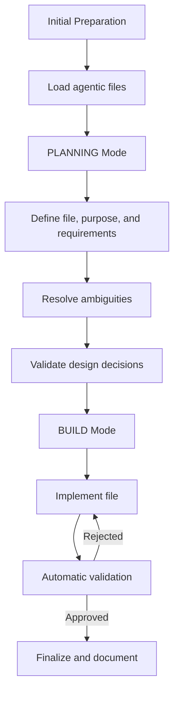

# **PROMPT_GUIDE.md**

*Guide for using AI agents in software project development.*

---
## **Table of Contents**

- [**PROMPT\_GUIDE.md**](#prompt_guidemd)
  - [**Table of Contents**](#table-of-contents)
  - [**1. Introduction**](#1-introduction)
  - [**2. AI Agent Workflow**](#2-ai-agent-workflow)
    - [**Workflow Diagram**](#workflow-diagram)
    - [**Detailed Steps**](#detailed-steps)
  - [**3. Prompt Structure**](#3-prompt-structure)
    - [**3.1. PLANNING Mode**](#31-planning-mode)
      - [**Base Template**](#base-template)
    - [**3.2. BUILD Mode**](#32-build-mode)
      - [**Base Template**](#base-template-1)
  - [**4. Best Practices**](#4-best-practices)
    - [**4.1. For Prompts**](#41-for-prompts)
    - [**4.2. For Agentic Files**](#42-for-agentic-files)
    - [**4.3. For Validation**](#43-for-validation)

---
## **1. Introduction**

This document describes the **standard workflow** for interacting with AI agents (such as Open Code or Windsurf) in software project development. Its goal is to ensure **consistency, quality, and efficiency** in code generation, documentation, and configurations.

**Key objectives:**

- Establish a clear process for **planning** and **building** files.
- Leverage agentic files (`AGENTS.md`, `skills/`, `specs/`) to maintain technical consistency.
- Automate the validation of generated code.

---
## **2. AI Agent Workflow**

The workflow is divided into **two main modes**:

1. **PLANNING Mode**: Design and clarification of requirements.
2. **BUILD Mode**: Implementation and validation of the file.

### **Workflow Diagram**



### **Detailed Steps**

1. **Initial Preparation:**
  - Load relevant agentic files (`AGENTS.md`, `skills/`, `specs/`).
  - Verify that the agent is in the **project root directory** (use `/pwd`).
2. **PLANNING Mode:**
  - Define the **file to generate**, its **purpose**, and **technical requirements**.
  - Resolve ambiguities with **clarification questions** (multiple-choice questionnaires).
  - Validate design decisions with the team or user.
3. **BUILD Mode:**
  - Implement the file according to the validated plan.
  - Automatically validate the generated code using the **verification checklist**.
  - Fix detected issues and repeat validation if necessary.
4. **Finalization:**
  - Document changes in Git (commit with a descriptive message).
  - Update reference files if necessary (e.g., `AGENTS.md`).

---
## **3. Prompt Structure**

Prompts for AI agents must follow a **clear and detailed** structure to ensure precise results. Below are the templates for each mode.

---
### **3.1. PLANNING Mode**

**Objective:** Define **what** will be built, **why**, and **how**, resolving ambiguities before implementation.

#### **Base Template**

```markdown
# MODE: PLANNING
**Additional Context:** [Attach or reference relevant agentic files, e.g.: "Use the skills from `typescript-skill.md` and the specs from `auth-module.md`"]

## Role
Act as a [Senior Software Engineer/Software Architect] specialized in [LANGUAGE/FRAMEWORK, e.g.: TypeScript/NestJS] and in the domain of [e.g.: authentication, microservices, etc.].

## File(s) to Generate
- **Name:** [E.g.: `src/middlewares/auth.middleware.ts`]
- **Type:** [Source code/Configuration/Documentation/Unit test/Script]
- **Location:** [Absolute or relative path from the project root]

## Description
[**Technical and functional** description of the file. Example:
"NestJS middleware to validate JWT tokens on protected routes. Implements the `NestMiddleware` interface and uses the `AuthService` for business logic."]

## Purpose
[Explain the **problem it solves** and its **impact on the system**. Example:
"Centralize JWT token validation to avoid duplicate code in controllers and ensure security across all protected routes. Reduces coupling between authentication logic and controllers."]

## Requirements
### Technical
- **Language/Version:** [E.g.: TypeScript 5.2, Python 3.11]
- **Dependencies:** [Explicit list with versions, e.g.: `@nestjs/jwt@10.2.0`, `bcrypt@5.1.1`]
- **Standards:**
  - Code: [E.g.: ESLint + Prettier, PEP 8]
  - Documentation: [E.g.: JSDoc for functions, docstrings in Python]
  - Testing: [E.g.: Jest for TypeScript, pytest for Python]
- **Environment Variables:** [E.g.: `JWT_SECRET`, `DATABASE_URL` (reference `.env.example`)]
- **Compatibility:** [E.g.: Node.js 18+, Docker 24.0+]

### Architectural
- **Patterns:** [E.g.: Middleware Pattern, Dependency Injection]
- **Principles:**
  - SOLID: [E.g.: "The middleware must have a single responsibility (SRP)."]
  - DRY: [E.g.: "Reuse `JwtPayload` from `src/types/auth.types.ts`."]
  - Orthogonality: [E.g.: "Do not couple token validation with database logic."]
- **Security:** [E.g.: "Use `jsonwebtoken` with HS256 algorithm and validate `exp` (expiration)."]

## Technical Specifications
- **Internal Structure:**
  - Classes/Interfaces: [E.g.: `class AuthMiddleware implements NestMiddleware`]
  - Functions/Methods: [E.g.: `use(req: Request, res: Response, next: NextFunction)`]
  - Constants: [E.g.: `DEFAULT_TOKEN_EXPIRY = '24h'`]
- **Business Logic:**
  1. [Step 1, e.g.: "Extract token from the `Authorization` header (format: `Bearer <token>`)."]
  2. [Step 2, e.g.: "Validate token with `jwt.verify(token, JWT_SECRET)`."]
  3. [Step 3, e.g.: "Attach payload to `req.user` and call `next()`."]
- **Error Handling:**
  - [E.g.: "Throw `UnauthorizedException` if the token is invalid or expired."]
  - [E.g.: "Use `try/catch` for `jsonwebtoken` errors."]

## Integration
- **Internal Dependencies:**
  - Imports: [E.g.: `import { AuthService } from '../auth/auth.service'`]
  - Related Files: [E.g.: "Depends on `auth.service.ts` and `user.entity.ts`."]
- **Expected Usage:**
  - [E.g.: "Register in `app.module.ts` with `app.use(new AuthMiddleware().use)`."]
- **Relevant Skills:** [E.g.: "Uses `nestjs-skill.md` for NestJS conventions."]
- **Agentic References:**
  - [E.g.: "Consult `specs/auth-module.md` for the authentication flow."]

## Clarification Questions
[**Mandatory:** Resolve ambiguities before moving to BUILD.]
1. **Multiple-Choice Questionnaire** (for critical decisions):
   - Example:
     ```
     Which encryption algorithm should be used for JWT?
     a) HS256 (HMAC + SHA-256) [Recommended for symmetric keys]
     b) RS256 (RSA + SHA-256) [Recommended for asymmetric keys]
     c) ES256 (ECDSA + SHA-256)
     ```
   - **Progress Bar:** `[1/3 questions resolved]`
2. **Dependency Validation:**
   - [E.g.: "Confirm that `jsonwebtoken@9.0.2` is in `package.json`. If not, run: `npm install jsonwebtoken@9.0.2`."]
3. **Design Decisions:**
   - [E.g.: "Should the middleware validate the user's role? (Yes/No). If Yes, specify allowed roles: [admin, user]."]

---
**Expected Output from PLANNING Mode (After Questionnaire):**
- A **technical summary** in table format with the decisions made.
- A **task list** for BUILD mode (e.g.: "1. Create `AuthMiddleware` class. 2. Implement `use` method.").
```

---
### **3.2. BUILD Mode**

**Objective:** Implement file(s) according to the validated plan and ensure their quality through automatic validation.

#### **Base Template**

```markdown
# MODE: BUILD
**Instruction:** "Implement file(s) according to the validated plan from PLANNING mode. Use the attached agentic files (`AGENTS.md`, `skills/`, `specs/`) to ensure consistency."

---
### **1. Implementation**
- Generate **complete** file(s) in the specified path.
- Include:
  - Necessary imports (verify absolute/relative paths).
  - Documentation (docstrings, JSDoc, comments).
  - Error handling as specified.
  - Usage examples in comments (if applicable).

---
### **2. Automatic Verification**
[**The agent must validate each point before finalizing.**]

#### **Validation Checklist**
1. **Technical Correctness:**
   - [ ] Are imports using correct paths?
   - [ ] Does the syntax comply with the standard (e.g.: PEP 8, ESLint)?
   - [ ] Are dependencies declared in `requirements.txt`/`package.json`?

2. **Robustness:**
   - [ ] Are all error cases handled (e.g.: invalid token, unavailable database)?
   - [ ] Is there input validation (e.g.: `if not token: raise Error`)?

3. **Consistency:**
   - [ ] Does the style (naming, indentation) match the project?
   - [ ] Are the conventions from `AGENTS.md` used (e.g.: `snake_case` for variables)?

4. **Security:**
   - [ ] Is there no hardcoding of credentials or sensitive configurations?
   - [ ] Are environment variables used for configurations (e.g.: `os.getenv("JWT_SECRET")`)?
   - [ ] Are security best practices followed for the file type?

5. **Performance:**
   - [ ] Are there no blocking operations (e.g.: `await` in loops)?
   - [ ] Are connections closed (e.g.: `db.close()`, `file.close()`)?
   - [ ] Are optimization techniques used (e.g.: cache, lazy loading)?

6. **Documentation:**
   - [ ] Are there docstrings/JSDoc for public functions?
   - [ ] Do comments explain the **why**, not the **what**?
   - [ ] Does the file include usage examples (if applicable)?

7. **Testing:**
   - [ ] Is the file **testable** in isolation?
   - [ ] Does it include examples or use cases to verify functionality?

8. **Integration:**
   - [ ] Does the file integrate with the specified modules/services?
   - [ ] Are import paths correct?

9. **Dependencies:**
   - [ ] Are all required dependencies declared?
   - [ ] Are there unnecessary or redundant dependencies?

10. **Scalability and Maintenance:**
    - [ ] Is the file structured to be easy to modify or extend?
    - [ ] Are strong couplings with other components avoided?

---
**Expected Output:**
- File generated in the correct path.
- **Validation report** with:
  - ✅ Points fulfilled.
  - ❌ Detected issues and applied corrections.
  - ⚠️ Warnings (e.g.: "Function `X` could be optimized with cache").
```

---
## **4. Best Practices**

### **4.1. For Prompts**

1. **Be Specific:**
   - Avoid vague instructions like "create a middleware". Instead, use: "Create a FastAPI middleware in `src/middlewares/jwt_bearer.py` that validates JWT tokens using `python-jose`."
2. **Include Context:**
   - Attach relevant agentic files (`AGENTS.md`, `skills/`, `specs/`).
   - Reference prior decisions (e.g.: "As agreed in `specs/auth-flow.md`, the token must expire in 24 hours").
3. **Validate Before Building:**
   - Resolve all ambiguities in PLANNING mode.
   - Use multiple-choice questionnaires for critical decisions.
4. **Use Technical Language:**
   - Incorrect example: "Make the middleware work."
   - Correct example: "Implement the `__call__` method in `JWTBearerMiddleware` to validate the JWT token using `jose.jwt.decode`."

---
### **4.2. For Agentic Files**

1. **Keep `AGENTS.md` Updated:**
   - Include all global project rules (standards, security, dependencies).
2. **Organize `skills/` by Technology:**
   - Example:
3. **Document `specs/` in Detail:**
   - Include diagrams (Mermaid), code examples, and endpoint tables.

---
### **4.3. For Validation**

1. **Automate Validation:**
   - Use the verification checklist in BUILD mode.
   - Configure Git hooks (pre-commit) to run linters and tests.
2. **Manually Review Critical Aspects:**
   - Security (e.g.: token handling, credentials).
   - Performance (e.g.: database queries, loops).
3. **Document Changes:**
   - Use descriptive commit messages:
     - ❌ `fix: middleware`
     - ✅ `feat(middleware): add JWT validation with python-jose`

---
