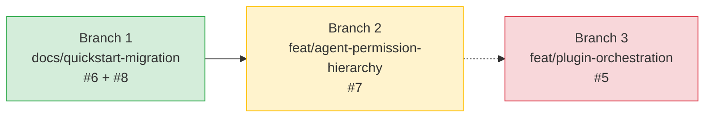

# Plan de Trabajo — Issues del Proyecto

> **Meta:** Resolver 4 issues organizadas en 3 branches, respetando dependencias conceptuales.
> **Inicio:** 2026-05-28
> **Estrategia:** Documentación primero → Agentes → Plugin (dependencia descendente)

---

## 📊 Resumen de Issues

| # | Título | Tipo | Prioridad | Dependencias |
|---|--------|------|-----------|-------------|
| **6** | Quickstart para limpieza y preparación de proyecto nuevo | `documentation` | Alta | Ninguna |
| **8** | Actualización manual de versiones anteriores | `(sin etiqueta)` | Alta | Ninguna |
| **7** | Nuevos agentes especializados en jerarquía de permisos | `enhancement` | Alta | Ninguna (conceptual precede a #5) |
| **5** | Establecer orquestación de agentes en el plugin | `enhancement` | Alta | Depende conceptualmente de #7 |

---

## 🗺️ Estrategia de Branches

### Branch 1: `docs/quickstart-migration`
**Issues:** #6 + #8
**Razón de agrupación:** Ambos modifican exclusivamente `USER_GUIDE.md` — misma superficie de cambio, cero conflictos.
**Orden:** Los cambios se escriben en una sola pasada.
**Base:** `develop` (fusionar aquí al finalizar y eliminar branch)
**Push a remoto:** ❌ No — solo trabajo local entre branches y `develop`. Los PRs los gestiona el usuario manualmente.

#### Issue #6 — Quickstart renovado con limpieza
**Archivos a modificar:**
- `USER_GUIDE.md` — Renovar sección QuickStart para incluir pasos de limpieza de proyecto

**Cambios específicos:**
1. Renombrar/enmarcar QuickStart como guía "Project Cleanup & Setup"
2. Agregar paso para limpieza de `README.md` (contenido total a reemplazar)
3. Agregar paso para limpieza de `CONTRIBUTING.md` (contenido total a reemplazar)
4. Agregar paso para limpieza de `CHANGELOG.md` (solo eliminar entradas de versiones, mantener estructura)
5. Configurar `opencode.json` con:
   - `model: opencode-go/kimi-k2.6`
   - `small_model: openrouter/z-ai/glm-4.5-air:free`
   - Agent configs: huitzilopochtli, quetzalcoatl, tezcatlipoca con modelos específicos
   - `instructions: ["CONTRIBUTING.md", "WORKFLOW.md", "SPEC.md"]`
6. Mantener pasos existentes de instalación de dependencias, Context7, MCP servers

#### Issue #8 — Manual Version Migration
**Archivos a modificar:**
- `USER_GUIDE.md` — Nueva sección independiente

**Cambios específicos:**
1. Agregar sección "🔄 Manual Version Migration" después del QuickStart renovado
2. Listar archivos/directorios a migrar manualmente:
   - `skills/`
   - `agents/`
   - `commands/`
   - `opencode.json`
   - `.opencode/`
   - `USER_GUIDE.md`
   - `docs/opencode/`
   - Opcional: `.windsurf/`
3. Describir el proceso de diff selectivo para cada uno

**Criterios de éxito:**
- [ ] USER_GUIDE.md tiene QuickStart renovado con pasos de limpieza
- [ ] USER_GUIDE.md tiene sección "Manual Version Migration"
- [ ] README.md, CONTRIBUTING.md, CHANGELOG.md mencionados como archivos a limpiar
- [ ] opencode.json template de configuración incluido

---

### Branch 2: `feat/agent-permission-hierarchy`
**Issues:** #7
**Base:** `develop` (fusionar aquí al finalizar y eliminar branch)
**Push a remoto:** ❌ No — solo trabajo local entre branches y `develop`.
**Archivos a modificar/crear:**
- `agents/huitzilopochtli.md` — Reemplazar completamente
- `agents/quetzalcoatl.md` — Reemplazar completamente
- `agents/tezcatlipoca.md` — Reemplazar completamente
- `agents/moctezuma.md` — CREAR (nuevo)
- `agents/tlaloc.md` — CREAR (nuevo)
- `agents/mictlantecuhtli.md` — CREAR (nuevo)
- `README.md` — Actualizar sección de agentes con lore mexica
- `USER_GUIDE.md` — Actualizar tabla Agent Personas (de 3 a 6)
- `docs/opencode/08-orchestration-patterns.md` — Actualizar tabla Agent Personas + agregar nuevos patrones
- `docs/opencode/09-agent-index.md` — Actualizar sección Primary Agents (de 3 a 6)

#### Diseño de los 6 Agentes

Basado en la issue #7, los agentes tienen permisos específicos:

| Agente | Comando | Escribe Docs | Escribe Código | Delega Docs | Delega Código |
|--------|---------|:---:|:---:|:---:|:---:|
| **Huitzilopochtli** | (orquestador) | ❌ | ❌ | ✅ | ✅ |
| **Quetzalcoatl** | `/spec`, `/design` | ❌ | ❌ | ✅ | ❌ |
| **Moctezuma** | `/plan` | ✅ | ❌ | ❌ | ❌ |
| **Tlaloc** | `/build` | ✅ | ✅ | ✅ | ✅ |
| **Mictlantecuhtli** | `/test`, `/ship` | ✅ | ✅ | ❌ | ❌ |
| **Tezcatlipoca** | `/review` | ❌ | ❌ | ❌ | ❌ |

**System prompts:** Cada agente tendrá un system prompt <60 líneas con:
- Rol y lore (conexión mitológica mexica)
- Capacidades y restricciones de permisos
- Reglas de delegación (si aplica)
- Fuentes de conocimiento (flujo: AGENTS.md → WORKFLOW.md → ...)
- Bloque Composition

#### Lore mexica para README

Actualizar sección "Agentes Principales" con descripciones míticas:
- **Huitzilopochtli** — "Colibrí Zurdo", dios de la guerra y el sol. Comandante supremo que dirige la batalla del desarrollo.
- **Quetzalcoatl** — "Serpiente Emplumada", dios del conocimiento y los vientos. Visionario que concibe la arquitectura.
- **Moctezuma** — El estratega, gran organizador del imperio en calpullis (tareas).
- **Tlaloc** — Dios de la lluvia que hace "llover" código sobre el proyecto.
- **Mictlantecuhtli** — Señor del Mictlán, juez implacable que somete el código a pruebas.
- **Tezcatlipoca** — "Espejo Humeante", dios que todo lo ve. Solo observa y critica.

**Criterios de éxito:**
- [ ] 3 agentes existentes reemplazados con nuevos system prompts
- [ ] 3 agentes nuevos creados (moctezuma, tlaloc, mictlantecuhtli)
- [ ] README.md actualizado con lore mexica
- [ ] USER_GUIDE.md tabla de 3→6 agentes
- [ ] 08-orchestration-patterns.md actualizado
- [ ] 09-agent-index.md actualizado

---

### Branch 3: `feat/plugin-orchestration`
**Issues:** #5
**Base:** `develop` (fusionar aquí al finalizar y eliminar branch)
**Push a remoto:** ❌ No — solo trabajo local entre branches y `develop`.
**Dependencia conceptual:** Requiere que #7 esté definido (los agentes que el plugin orquestará)
**Archivos a modificar:**
- `.opencode/plugins/sdd-pipeline.ts` — Reescritura parcial con matriz de decisiones

#### Cambios específicos

1. **Actualizar `AGENT_DETECT_PATTERNS`** para detectar los 6 agentes:
   - huitzilopochtli, quetzalcoatl, moctezuma, tlaloc, mictlantecuhtli, tezcatlipoca

2. **Actualizar `buildRoleRules()`** para los 6 agentes con sus restricciones:
   - Huitzilopochtli: solo delega, no escribe
   - Quetzalcoatl: planea, no escribe código, solo delega docs
   - Moctezuma: escribe planes, no código, no delega
   - Tlaloc: escribe todo, delega si se agotan steps
   - Mictlantecuhtli: escribe tests, no delega
   - Tezcatlipoca: solo lee y critica, no escribe nada

3. **Implementar matriz de decisiones de delegación** (basada en el flowchart de la issue #5):
   ```
   ¿Puede escribir el agente primario?
     ├── NO → NO DELEGAR, mostrar resultado de instrucciones
     └── SÍ → ¿Qué debe producir?
              ├── Documentación → ¿Puede/Tiene steps?
              │   ├── SÍ → Escribe él mismo
              │   └── NO → DELEGAR a subagente de docs
              └── Código → ¿Puede/Tiene steps?
                  ├── SÍ → Escribe él mismo
                  └── NO → ¿Es Flexible?
                      ├── SÍ (Huitzilopochtli) → DELEGAR al subagente más apto
                      └── NO → NO DELEGAR (especialista rígido)
   ```

4. **Agregar tool restrictions** en `tool.execute.before`:
   - Huitzilopochtli: bloquear Write/Edit (solo delega)
   - Quetzalcoatl: bloquear Write/Edit de código (permitir docs)
   - Tezcatlipoca: bloquear Write/Edit completamente (solo lectura)
   - Moctezuma: bloquear ejecución de código (solo docs de planificación)

5. **Considerar separación en múltiples archivos**:
   - `sdd-pipeline.ts` — Plugin principal + hooks
   - `sdd-agents.ts` — Configuración de agentes (detect patterns, role rules)
   - `sdd-delegation.ts` — Matriz de decisiones de delegación
   - `sdd-permissions.ts` — Restricciones de herramientas por agente

**Criterios de éxito:**
- [ ] Plugin detecta correctamente los 6 agentes
- [ ] Role rules inyectadas correctamente para cada agente
- [ ] Tool restrictions bloquean acciones no permitidas por agente
- [ ] Matriz de decisiones implementada (flujo de delegación)
- [ ] Plugin compila sin errores (`bun build` o typecheck)

---

## 📐 Dependencias y Orden de Ejecución



1. **Branch 1** (#6+#8): Documentación — sin dependencias, se puede mergear rápido
2. **Branch 2** (#7): Agentes — sin dependencias técnicas, pero conceptualmente necesaria antes de #5
3. **Branch 3** (#5): Plugin — depende de #7 para saber qué agentes orquestar

> **Nota:** Las branches son independientes en términos de merge (no tocan los mismos archivos). Cada branch se fusiona en `develop` al finalizar y se elimina. No se hace push a remoto — los PRs los gestiona el usuario manualmente.

---

## 📋 Estimación de Esfuerzo

| Branch | Archivos a modificar | Archivos a crear | Complejidad |
|--------|:---:|:---:|:---:|
| `docs/quickstart-migration` | 1 | 0 | Baja (solo documentación) |
| `feat/agent-permission-hierarchy` | 5 | 3 | Alta ✅ Completada (en revisión) |
| `feat/plugin-orchestration` | 1-5 | 0-4 | Alta (lógica de plugin TypeScript) |

---

## 🚀 Post-Merge (en develop)

Después de fusionar las 3 branches en `develop`:

1. Verificar que todos los cambios están integrados correctamente (`git log --oneline --graph`)
2. Verificar que `opencode.json` reconoce los nuevos agentes
3. Reiniciar sesión de OpenCode
4. Probar `/spec`, `/plan`, `/build`, `/test`, `/review`, `/ship` con los nuevos agentes
5. Verificar que el plugin inyecta las role rules correctas
6. El usuario hace merge a `main` y push cuando esté listo
7. El usuario cierra las issues manualmente
